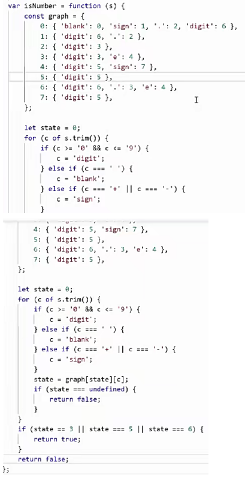
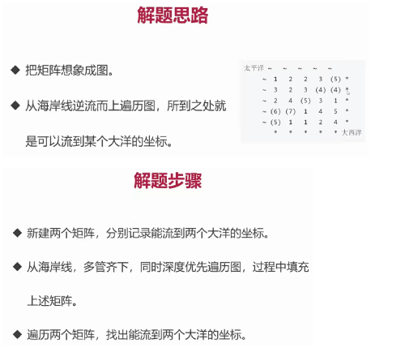
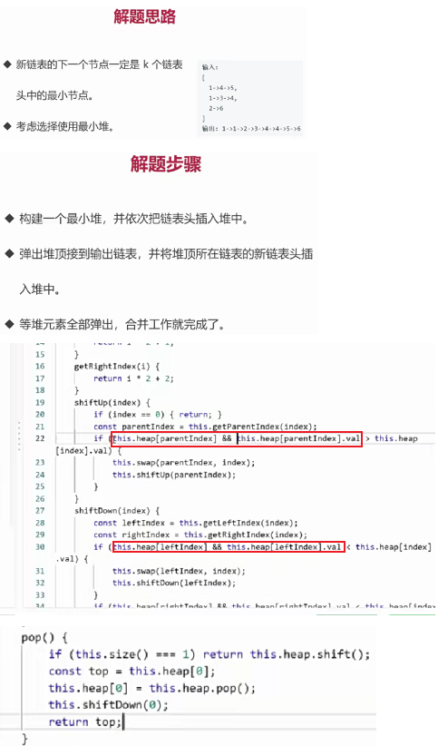

# 数据结构与算法

### 1.栈

[20.有效的括号](https://leetcode.cn/problems/valid-parentheses/description/)


### 2.队列

[933.最近的请求次数](https://leetcode.cn/problems/number-of-recent-calls/)


### 3.链表

[237.删除链表中的节点](https://leetcode.cn/problems/delete-node-in-a-linked-list/)


[206.反转链表](https://leetcode.cn/problems/reverse-linked-list/)


[2.两数相加](https://leetcode.cn/problems/add-two-numbers/)


[83.删除排序链表中的重复元素](https://leetcode.cn/problems/remove-duplicates-from-sorted-list/)


[141.环形链表](https://leetcode.cn/problems/linked-list-cycle/)


**前端与链表：JS 中的原型链**


**instanceof 的原理，并用代码实现。**


**前端与链表：使用链表指针获取 JSON 的节点值**

```js
const json = {
  a: { b: { c: 1 } },
  d: { e: 2 }
};

const path = ['a', 'b', 'c'];

let p = json;
path.forEach(k => {
  p = p[k];
});
```

### 4.集合

[349.两个数组的交集](https://leetcode.cn/problems/intersection-of-two-arrays/)


### 5.字典

[349.两个数组的交集](https://leetcode.cn/problems/intersection-of-two-arrays/)


[20.有效的括号](https://leetcode.cn/problems/valid-parentheses/description/)


[1.两数之和](https://leetcode.cn/problems/two-sum/)


[3.无重复字符的最长子串](https://leetcode.cn/problems/longest-substring-without-repeating-characters/)


[76.最小覆盖子串](https://leetcode.cn/problems/minimum-window-substring/)


### 6.树

[104.二叉树的最大深度](https://leetcode.cn/problems/maximum-depth-of-binary-tree/)


[111.二叉树的最小深度](https://leetcode.cn/problems/minimum-depth-of-binary-tree/)


[102. 二叉树的层序遍历](https://leetcode.cn/problems/binary-tree-level-order-traversal/description/)


[94. 二叉树的中序遍历](https://leetcode.cn/problems/binary-tree-inorder-traversal/)


[112. 路径总和](https://leetcode.cn/problems/path-sum/)


**前端与树:遍历 JSON 的所有节点值**

```js
const json = {
  a: { b: { c: 1 } },
  d: [1, 2]
};

const dfs = (n, path) => {
  console.log(n, path);
  Object.keys(n).forEach(k => {
    dfs(n[k], path.concat(k));
  });
};

dfs(json, []);
```

**前端与树:渲染 Antd 的树组件**


### 7.图

[65. 有效数字](https://leetcode.cn/problems/valid-number/description/)

 

[417. 太平洋大西洋水流问题](https://leetcode.cn/problems/pacific-atlantic-water-flow/)

 

[133. 克隆图](https://leetcode.cn/problems/clone-graph/)

 

### 8.堆

[215.数组中的第 K 个最大元素](https://leetcode.cn/problems/kth-largest-element-in-an-array/)


[347.前 K 个高频元素](https://leetcode.cn/problems/top-k-frequent-elements/)


[23.合井 K 个升序链表](https://leetcode.cn/problems/merge-k-sorted-lists/)

 

### 9.排序和搜索

[21.合并两个有序链表](https://leetcode.cn/problems/merge-two-sorted-lists/)


[374.猜数字大小](https://leetcode.cn/problems/guess-number-higher-or-lower/)


### 10.分而治之(思想)

[374.猜数字大小](https://leetcode.cn/problems/guess-number-higher-or-lower/)


[226. 翻转二叉树](https://leetcode.cn/problems/invert-binary-tree/)


[100. 相同的树](https://leetcode.cn/problems/same-tree/)


[101. 对称二叉树](https://leetcode.cn/problems/symmetric-tree/)


### 11.动态规划(思想)

[70. 爬楼梯](https://leetcode.cn/problems/climbing-stairs/)


[198. 打家劫舍](https://leetcode.cn/problems/house-robber/)


### 12.贪心算法(思想)

[455. 分发饼干](https://leetcode.cn/problems/assign-cookies/description/)


[122. 买卖股票的最佳时机 II](https://leetcode.cn/problems/best-time-to-buy-and-sell-stock-ii/)


### 13.回溯算法(思想)

[46. 全排列](https://leetcode.cn/problems/permutations/description/)


[78. 子集](https://leetcode.cn/problems/subsets/)


