### 1.理论

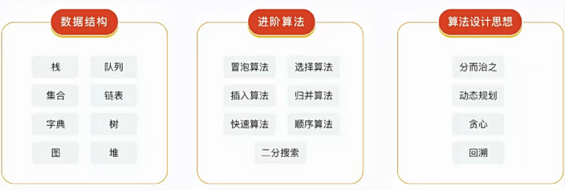

### 2.时间、空间复杂度

时间复杂度：

1. 一个函数，用大 O 表示，比如 O(1)、O(n)、O(logN)....
2. 定性描述该算法的运行时间

O(1)

```js
let i = 0;
i += 1;
```

O(n)

```js
for (let i = 0; i < n; i += 1) {
  console.log(i);
}
```

O(1) + O(n) = O(n)

```js
let i = 0;
i += 1;
for (let j = 0; j < n; j += 1) {
  console.log(j);
}
```

O(n) \* O(n) = O(n^2)

```js
for (let i = 0; i < n; i += 1) {
  for (let j = 0; j < n; j += 1) {
    console.log(i, j);
  }
}
```

O(logN)

```js
let i = 1;
while (i <= n) {
  console.log(i);
  i *= 2;
}
```

空间复杂度：

1. 一个函数，用大 O 表示，比如 O(1)、O(n)、O(n^2)....
2. 算法在运行过程中临时占用存储空间大小的量度

O(1)

```js
let i = 0;
i += 1;
```

O(n)

```js
let arr = [];
for (let i = 0; i < n; i += 1) {
  arr.push(i);
}
```

O(n^2)

```js
let matrix = [];
for (let i = 0; i < n; i += 1) {
  matrix.push([]);
  for (let j = 0; j < n; j += 1) {
    matrix[i].push(j);
  }
}
```

### 3.栈

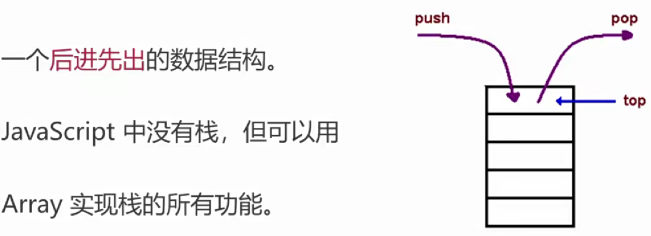

```js
let stack = [];
stack.push(1);
stack.push(2);
stack.pop(); // 2
stack.pop(); // 1
```

**栈的应用场景：需要后进先出的场景**

1. 函数调用
2. 括号匹配
3. 撤销重做
4. 浏览器前进后退
5. 迷宫求解
6. 十进制转二进制
7. 判断字符串的括号是否有效

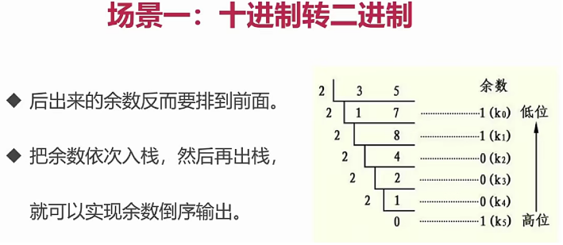 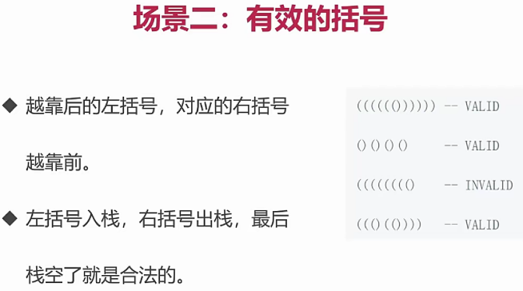 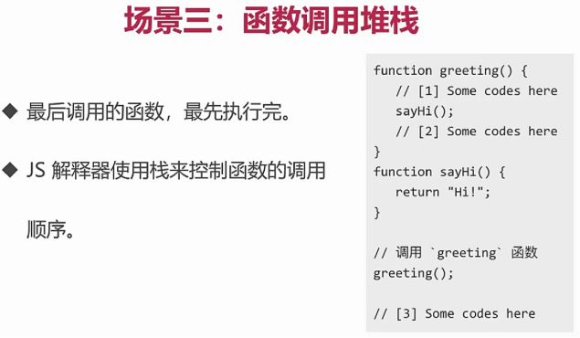

[20.有效的括号](https://leetcode.cn/problems/valid-parentheses/description/)

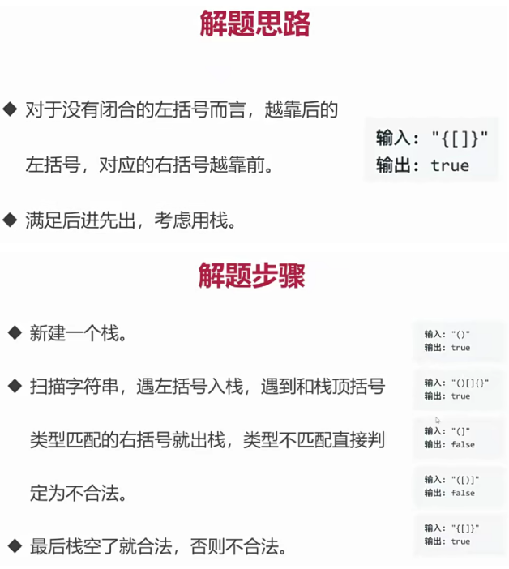

### 4.队列

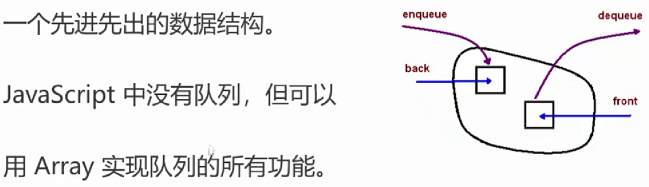

```js
let queue = [];
queue.push(1);
queue.push(2);
queue.shift(); // 1
queue.shift(); // 2
```

**队列的应用场景：需要先进先出的场景**

1. 线程池
2. 消息队列
3. 浏览器页面
4. 食堂打饭
5. JS 异步中的任务队列
6. 计算最近请求次数

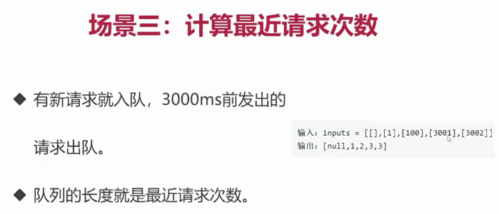

[933.最近的请求次数](https://leetcode.cn/problems/number-of-recent-calls/)

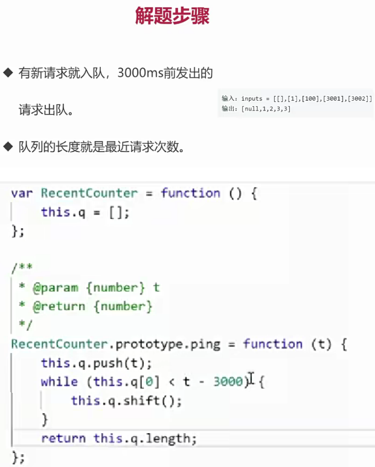

### 5.链表

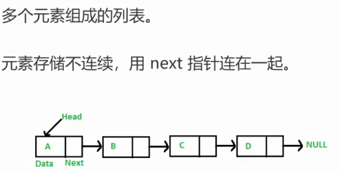 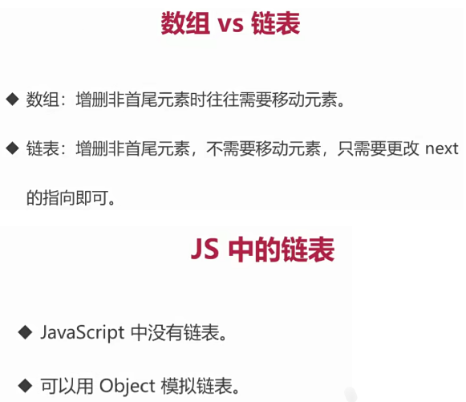

```js
const a = { val: 'a' };
const b = { val: 'b' };
const c = { val: 'c' };
const d = { val: 'd' };
a.next = b;
b.next = c;
c.next = d;

// 遍历链表
let p = a;
while (p) {
  console.log(p.val);
  p = p.next;
}

// 插入
const e = { val: 'e' };
c.next = e;
e.next = d;

// 删除
c.next = d;
```

[237.删除链表中的节点](https://leetcode.cn/problems/delete-node-in-a-linked-list/)

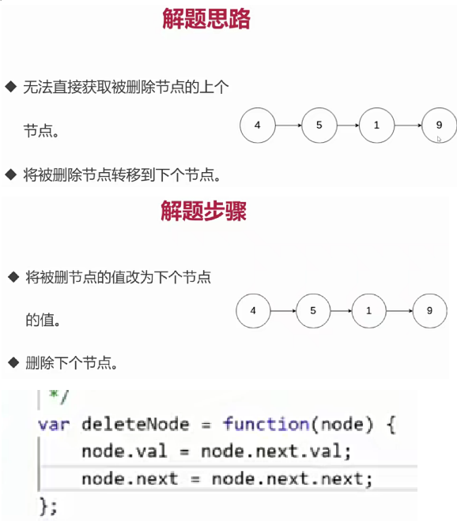

[206.反转链表](https://leetcode.cn/problems/reverse-linked-list/)

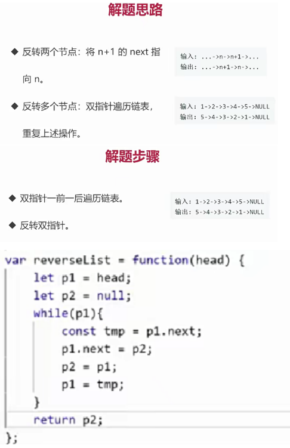

[2.两数相加](https://leetcode.cn/problems/add-two-numbers/)

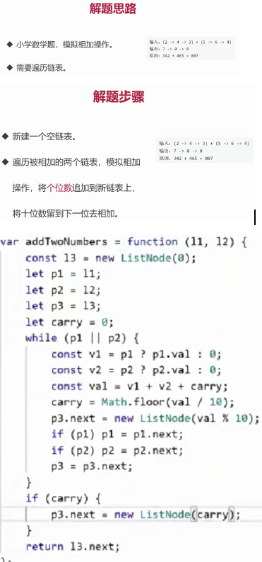

[83.删除排序链表中的重复元素](https://leetcode.cn/problems/remove-duplicates-from-sorted-list/)


[141.环形链表](https://leetcode.cn/problems/linked-list-cycle/)

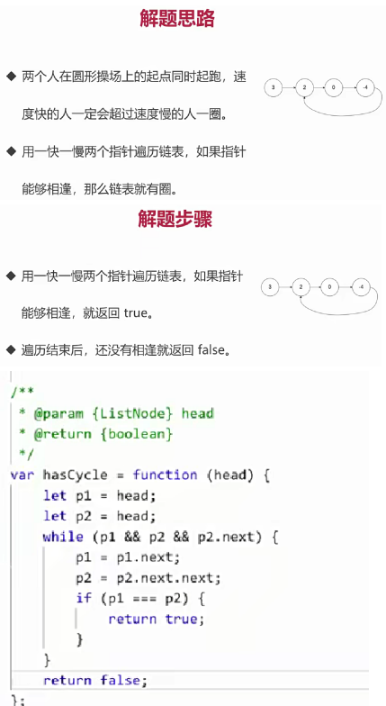

**前端与链表：JS 中的原型链**

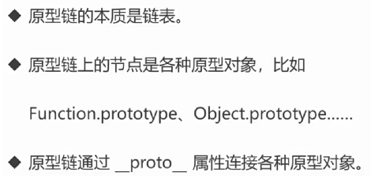

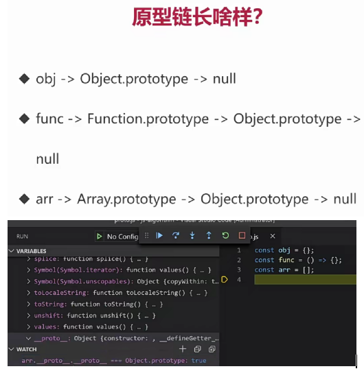

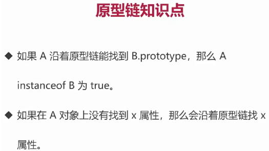

**instanceof 的原理，并用代码实现。**

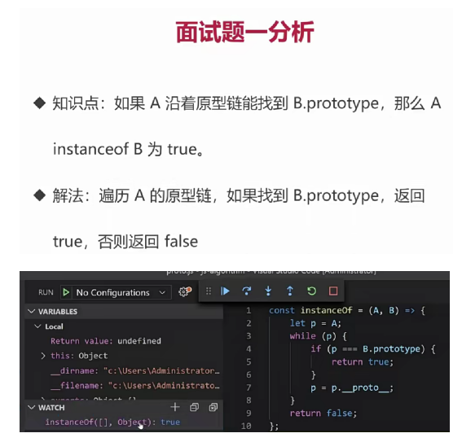

**前端与链表：使用链表指针获取 JSON 的节点值**

```js
const json = {
  a: { b: { c: 1 } },
  d: { e: 2 },
};

const path = ['a', 'b', 'c'];

let p = json;
path.forEach(k => {
  p = p[k];
});
```

### 6.集合

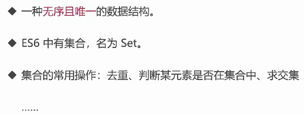

```js
// 去重
const arr = [1, 1, 2, 2];
const arr2 = [...new Set(arr)];

// 判断元素是否在集合中
const set = new Set(arr);
const has = set.has(3);

// 求交集
const set2 = new Set([2, 3]);
const set3 = new Set([...set].filter(item => set2.has(item)));
```

[349.两个数组的交集](https://leetcode.cn/problems/intersection-of-two-arrays/)


**前端与集合：使用 ES6 的 Set**

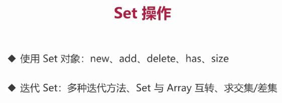

```js
let mySet = new Set();

mySet.add(1);
mySet.add(5);
mySet.add(5);
mySet.add('some text');
let o = { a: 1, b: 2 };
mySet.add(o);
mySet.add({ a: 1, b: 2 });

const has = mySet.has(o);

mySet.delete(5);

for (let [key, value] of mySet.entries()) console.log(key, value);

const myArr = Array.from(mySet);

const mySet2 = new Set([1, 2, 3, 4]);

const intersection = new Set([...mySet].filter(x => mySet2.has(x)));
const difference = new Set([...mySet].filter(x => !mySet2.has(x)));
```

### 7.字典

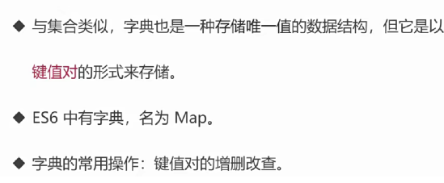

```js
const m = new Map();

// 增
m.set('a', 'aa');
m.set('b', 'bb');

// 删
m.delete('b');
// m.clear();

// 改
m.set('a', 'aaa');
```

[349.两个数组的交集](https://leetcode.cn/problems/intersection-of-two-arrays/)


[20.有效的括号](https://leetcode.cn/problems/valid-parentheses/description/)

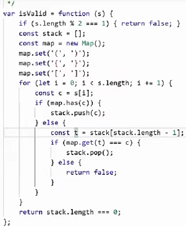

[1.两数之和](https://leetcode.cn/problems/two-sum/)

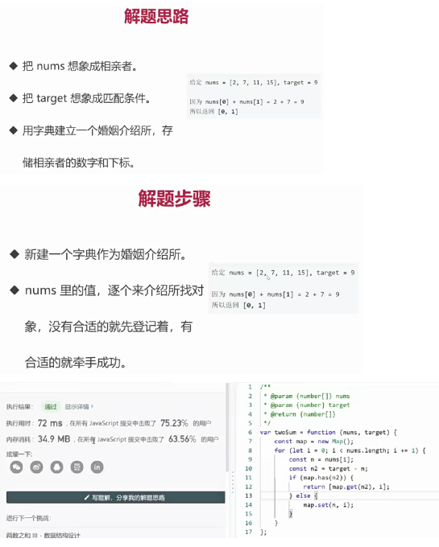

[3.无重复字符的最长子串](https://leetcode.cn/problems/longest-substring-without-repeating-characters/)

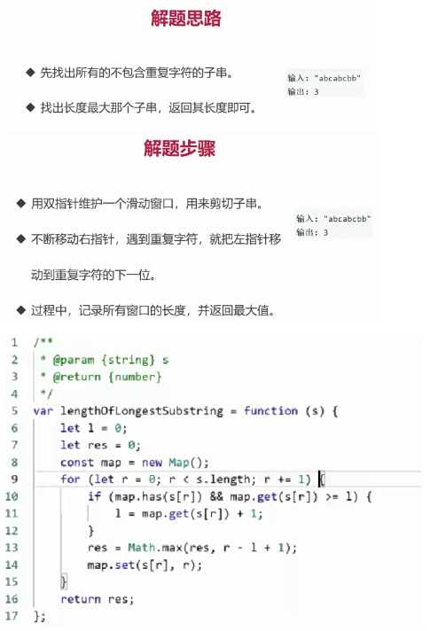

[76.最小覆盖子串](https://leetcode.cn/problems/minimum-window-substring/)

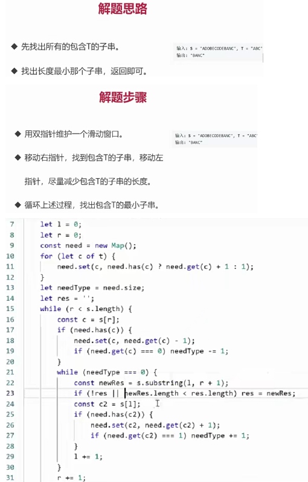

### 8.树

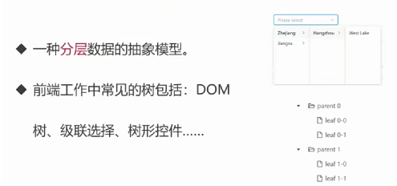

**树的其他常用操作:深度/广度优先遍历、先中后序遍历**

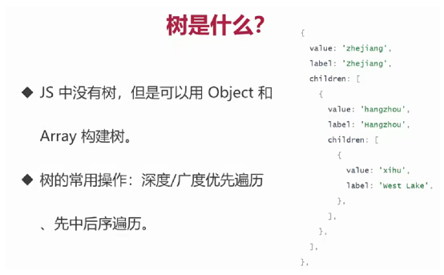

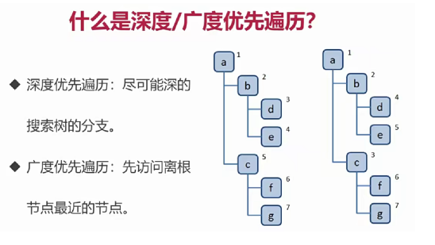

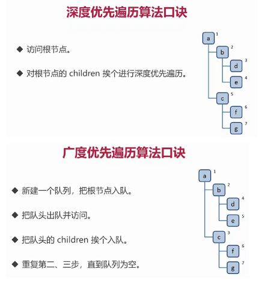

**二叉树的先中后序遍历**

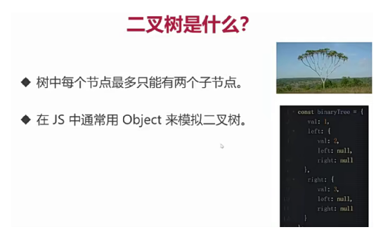

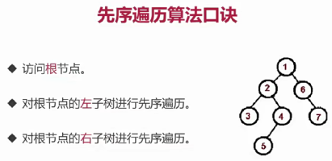

```js
const bt = {
  val: 1,
  left: {
    val: 2,
    left: {
      val: 4,
      left: null,
      right: null,
    },
    right: {
      val: 5,
      left: null,
      right: null,
    },
  },
  right: {
    val: 3,
    left: {
      val: 6,
      left: null,
      right: null,
    },
    right: {
      val: 7,
      left: null,
      right: null,
    },
  },
};
module.exports = bt;
```

```js
const bt = require('./bt');

const preorder = root => {
  if (!root) {
    return;
  }
  console.log(root.val);
  preorder(root.left);
  preorder(root.right);
};

// const preorder = (root) => {
//     if (!root) { return; }
//     const stack = [root];
//     while (stack.length) {
//         const n = stack.pop();
//         console.log(n.val);
//         if (n.right) stack.push(n.right);
//         if (n.left) stack.push(n.left);
//     }
// };

preorder(bt);
```

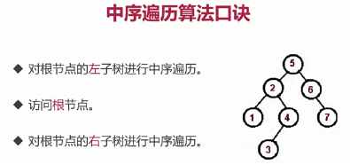

```js
const bt = require('./bt');

const inorder = root => {
  if (!root) {
    return;
  }
  inorder(root.left);
  console.log(root.val);
  inorder(root.right);
};

// const inorder = (root) => {
//     if (!root) { return; }
//     const stack = [];
//     let p = root;
//     while (stack.length || p) {
//         while (p) {
//             stack.push(p);
//             p = p.left;
//         }
//         const n = stack.pop();
//         console.log(n.val);
//         p = n.right;
//     }
// };

inorder(bt);
```

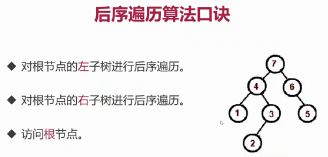

```js
const bt = require('./bt');

const postorder = root => {
  if (!root) {
    return;
  }
  postorder(root.left);
  postorder(root.right);
  console.log(root.val);
};

// const postorder = (root) => {
//     if (!root) { return; }
//     const outputStack = [];
//     const stack = [root];
//     while (stack.length) {
//         const n = stack.pop();
//         outputStack.push(n);
//         if (n.left) stack.push(n.left);
//         if (n.right) stack.push(n.right);
//     }
//     while(outputStack.length){
//         const n = outputStack.pop();
//         console.log(n.val);
//     }
// };

postorder(bt);
```

[104.二叉树的最大深度](https://leetcode.cn/problems/maximum-depth-of-binary-tree/)


[111.二叉树的最小深度](https://leetcode.cn/problems/minimum-depth-of-binary-tree/)

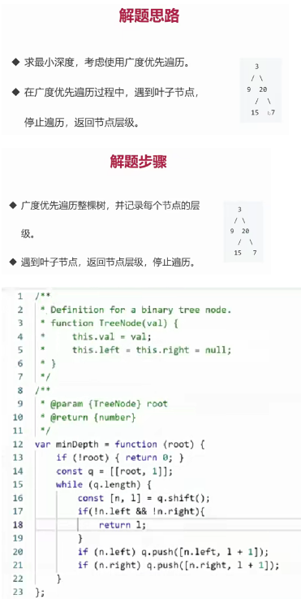

[102. 二叉树的层序遍历](https://leetcode.cn/problems/binary-tree-level-order-traversal/description/)

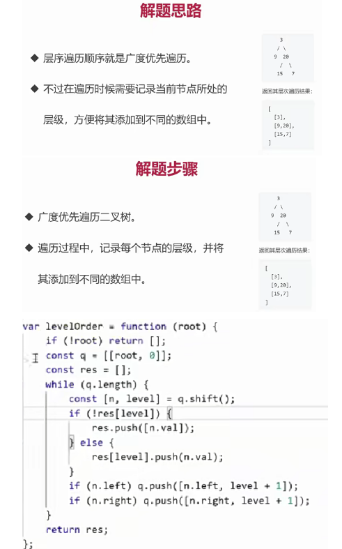

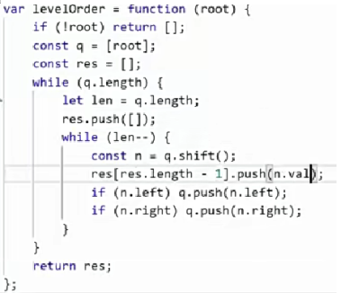

[94. 二叉树的中序遍历](https://leetcode.cn/problems/binary-tree-inorder-traversal/)

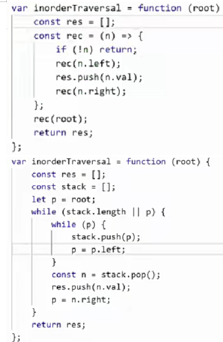

[112. 路径总和](https://leetcode.cn/problems/path-sum/)

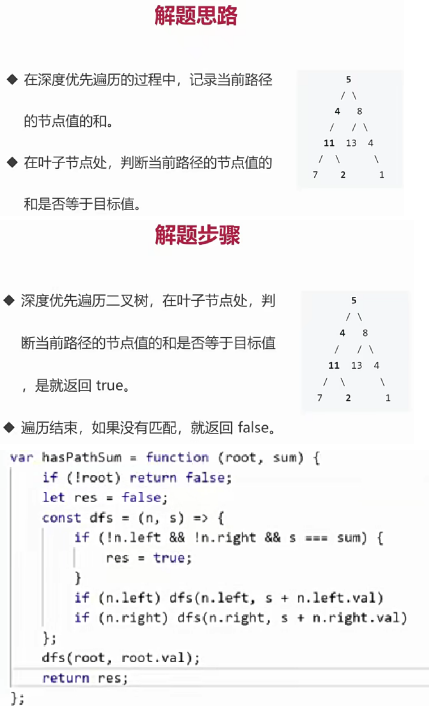

**前端与树:遍历 JSON 的所有节点值**

```js
const json = {
  a: { b: { c: 1 } },
  d: [1, 2],
};

const dfs = (n, path) => {
  console.log(n, path);
  Object.keys(n).forEach(k => {
    dfs(n[k], path.concat(k));
  });
};

dfs(json, []);
```

**前端与树:渲染 Antd 的树组件**

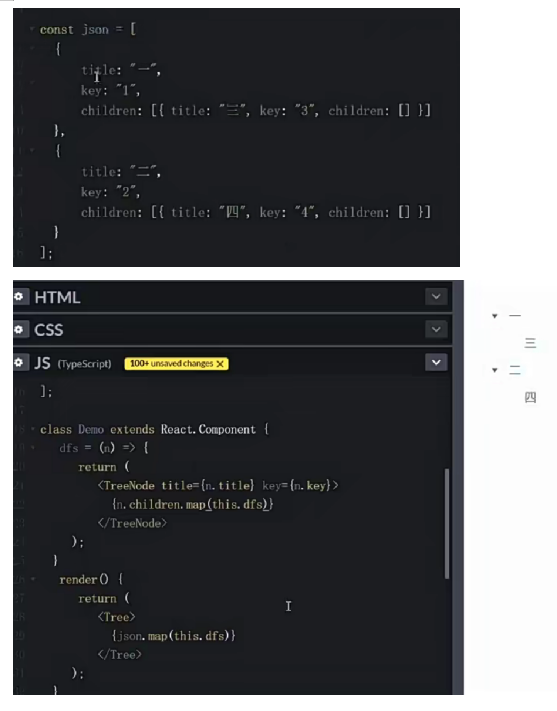

### 9.图

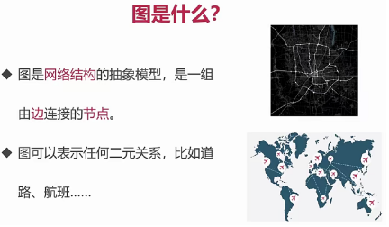

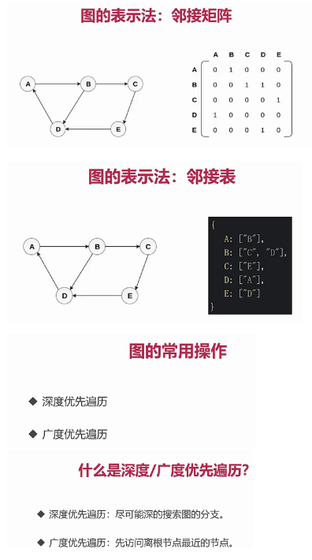

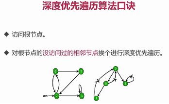

```js
const graph = {
  0: [1, 2],
  1: [2],
  2: [0, 3],
  3: [3],
};

module.exports = graph;
```

```js
const graph = require('./graph');

const visited = new Set();
const dfs = n => {
  console.log(n);
  visited.add(n);
  graph[n].forEach(c => {
    if (!visited.has(c)) {
      dfs(c);
    }
  });
};

dfs(2);
```

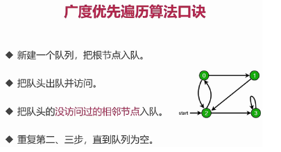

```js
const graph = require('./graph');

const visited = new Set();
const q = [2];
while (q.length) {
  const n = q.shift();
  console.log(n);
  visited.add(n);
  graph[n].forEach(c => {
    if (!visited.has(c)) {
      q.push(c);
    }
  });
}
```

```js{557,565}
const graph = require('./graph');

const visited = new Set();
visited.add(2)
const q = [2];
while (q.length) {
  const n = q.shift();
  console.log(n);
  graph[n].forEach(c => {
    if (!visited.has(c)) {
      q.push(c);
        visited.add(n);
    }
  });
}
```

[65. 有效数字](https://leetcode.cn/problems/valid-number/description/)

 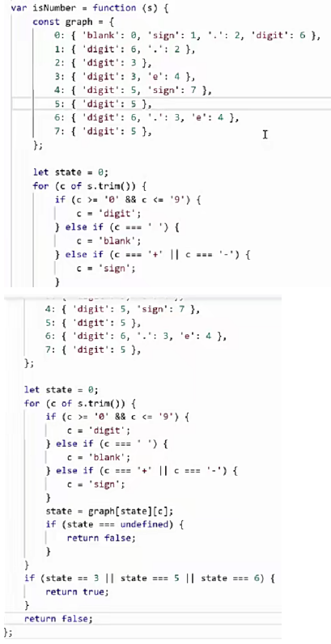

[417. 太平洋大西洋水流问题](https://leetcode.cn/problems/pacific-atlantic-water-flow/)

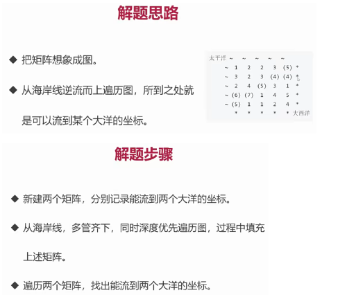 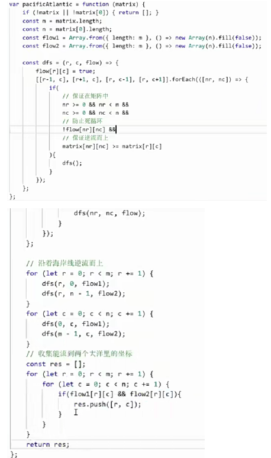

[133. 克隆图](https://leetcode.cn/problems/clone-graph/)

 

### 10.堆

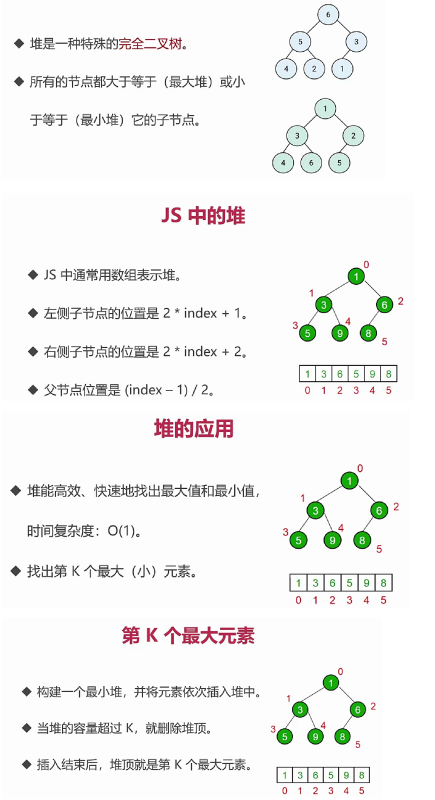

**JavaScript 实现：最小堆类**

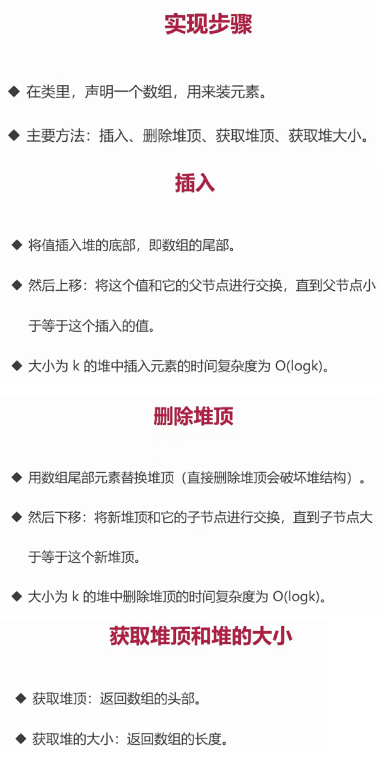

```js
class MinHeap {
  constructor() {
    this.heap = [];
  }
  swap(i1, i2) {
    const temp = this.heap[i1];
    this.heap[i1] = this.heap[i2];
    this.heap[i2] = temp;
  }
  getParentIndex(i) {
    return (i - 1) >> 1; // same as Math.floor((i - 1) / 2)
  }
  getLeftIndex(i) {
    return i * 2 + 1;
  }
  getRightIndex(i) {
    return i * 2 + 2;
  }
  shiftUp(index) {
    if (index === 0) return;
    const parentIndex = this.getParentIndex(index);
    if (this.heap[parentIndex] > this.heap[index]) {
      this.swap(parentIndex, index); // swap parent and child
      this.shiftUp(parentIndex);
    }
  }
  shiftDown(index) {
    const leftIndex = this.getLeftIndex(index);
    const rightIndex = this.getRightIndex(index);
    if (this.heap[leftIndex] < this.heap[index]) {
      this.swap(leftIndex, index);
      this.shiftDown(leftIndex);
    }
    if (this.heap[rightIndex] < this.heap[index]) {
      this.swap(rightIndex, index);
      this.shiftDown(rightIndex);
    }
  }
  insert(value) {
    this.heap.push(value);
    this.shiftUp(this.heap.length - 1);
  }
  pop() {
    this.heap[0] = this.heap.pop();
    this.shiftDown(0);
  }
  peek() {
    return this.heap[0];
  }
  size() {
    return this.heap.length;
  }
}

const minHeap = new MinHeap();
minHeap.insert(3); // [3]
minHeap.insert(2); // [2, 3]
minHeap.insert(1); // [1, 3, 2]
minHeap.pop(); // [2, 3]
minHeap.peek(); // 2
minHeap.size(); // 2
```

[215.数组中的第 K 个最大元素](https://leetcode.cn/problems/kth-largest-element-in-an-array/)

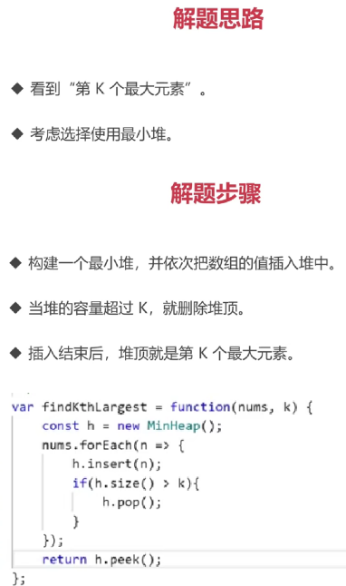

[347.前 K 个高频元素](https://leetcode.cn/problems/top-k-frequent-elements/)

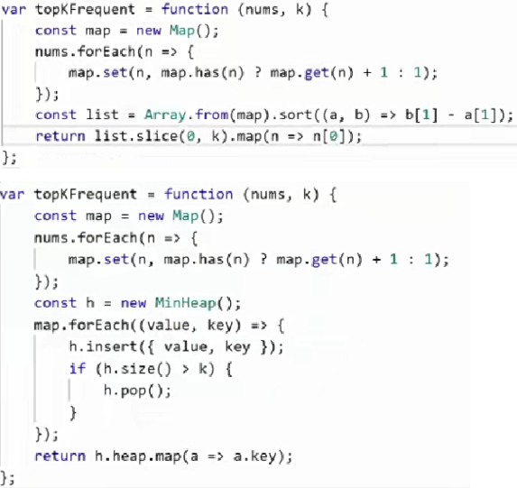

[23.合井 K 个升序链表](https://leetcode.cn/problems/merge-k-sorted-lists/)

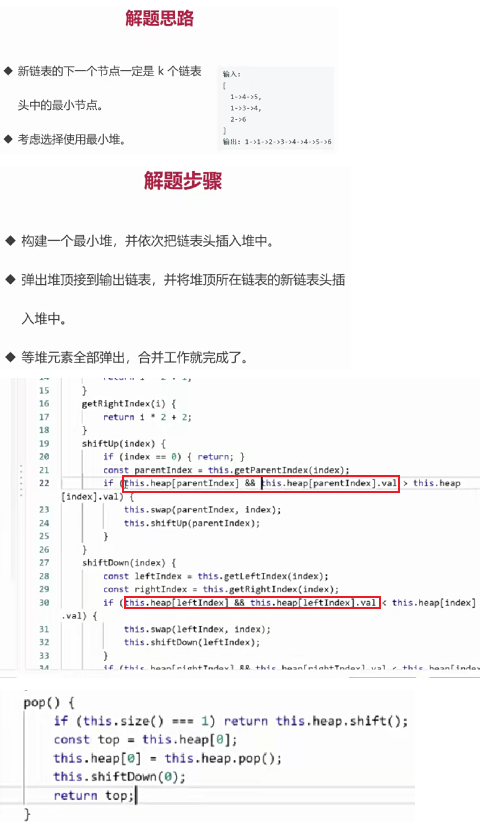 

### 11.排序和搜索

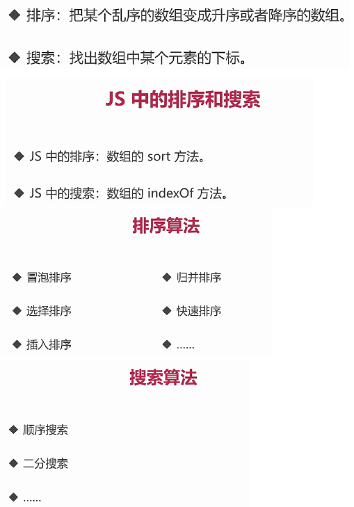

**JavaScript 实现：冒泡排序**

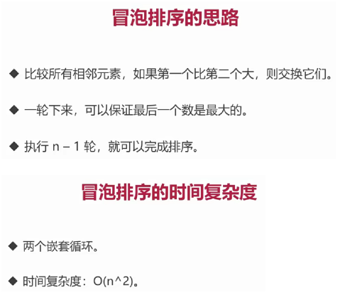

```js
Array.prototype.bubbleSort = function () {
  for (let i = 0; i < this.length - 1; i++) {
    for (let j = 0; j < this.length - 1 - i; j++) {
      if (this[j] > this[j + 1]) {
        let temp = this[j];
        this[j] = this[j + 1];
        this[j + 1] = temp;
      }
    }
  }
  return this;
};

const arr = [5, 3, 8, 4, 2];
console.log(arr.bubbleSort()); //[ 2, 3, 4, 5, 8 ]
```

**JavaScript 实现：选择排序**

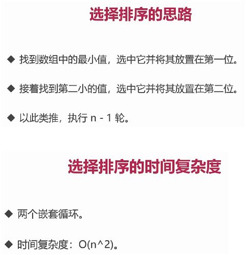

```js
Array.prototype.selectionSort = function () {
  for (let i = 0; i < this.length - 1; i++) {
    let min = i;
    for (let j = i; j < this.length; j++) {
      if (this[j] < this[min]) {
        min = j;
      }
    }
    if (min !== i) {
      let temp = this[i];
      this[i] = this[min];
      this[min] = temp;
    }
  }
  return this;
};

const arr = [5, 3, 8, 4, 2];
console.log(arr.selectionSort()); //[ 2, 3, 4, 5, 8 ]
```

**JavaScript 实现：插入排序**

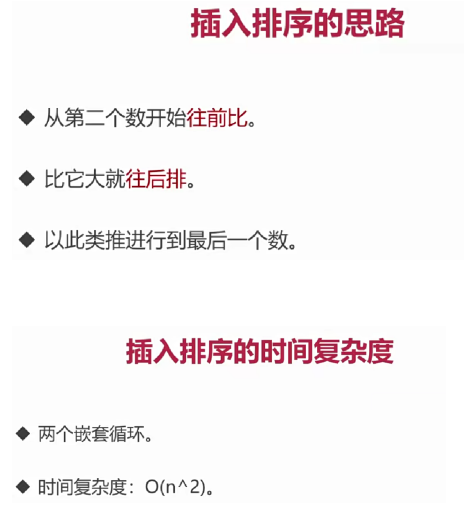

```js
Array.prototype.insertionSort = function () {
  const temp = this[1];
  let j = 1;
  while (j > 0) {
    if (this[j - 1] > temp) {
      this[j] = this[j - 1];
    } else {
      break;
    }
    j--;
  }
  this[j] = temp;
};

Array.prototype.insertionSort = function () {
  for (let i = 1; i < this.length; i++) {
    const temp = this[i];
    let j = i;
    while (j > 0) {
      if (this[j - 1] > temp) {
        this[j] = this[j - 1];
      } else {
        break;
      }
      j--;
    }
    this[j] = temp;
  }
  return this;
};
const arr = [5, 3, 8, 4, 2];
console.log(arr.insertionSort()); // [ 2, 3, 4, 5, 8 ]
```

**JavaScript 实现：归并排序**

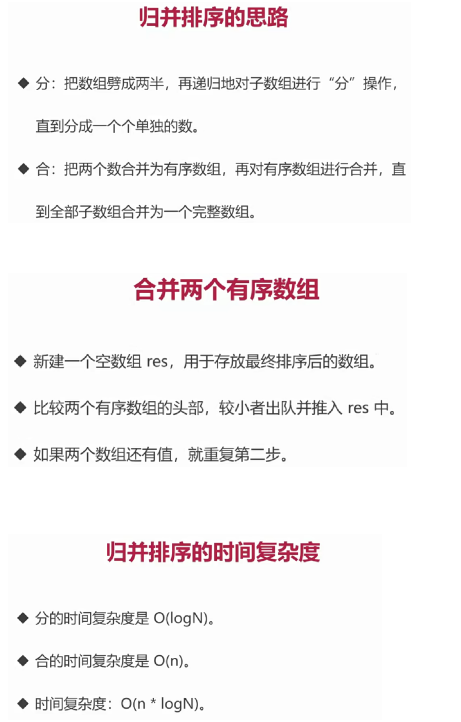

```js
Array.prototype.mergeSort = function () {
  const rec = arr => {
    if (arr.length === 1) {
      return arr;
    }
    const mid = Math.floor(arr.length / 2);
    const left = arr.slice(0, mid);
    const right = arr.slice(mid);
    const orderLeft = rec(left);
    const orderRight = rec(right);
    const res = [];
    while (orderLeft.length || orderRight.length) {
      if (orderLeft.length && orderRight.length) {
        res.push(orderLeft[0] < orderRight[0] ? orderLeft.shift() : orderRight.shift());
      } else if (orderLeft.length) {
        res.push(orderLeft.shift());
      } else {
        res.push(orderRight.shift());
      }
    }
    return res;
  };
  const res = rec(this);
  res.forEach((n, i) => {
    this[i] = n;
  });
  return this;
};

const arr = [5, 3, 8, 4, 2];
console.log(arr.mergeSort()); //[ 2, 3, 4, 5, 8 ]
```

**JavaScript 实现：快速排序**

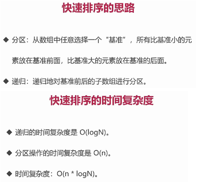

```js
Array.prototype.quickSort = function () {
  const rec = arr => {
    if (arr.length === 1) {
      return arr;
    }
    const left = [];
    const right = [];
    const mid = arr[0];
    for (let i = 1; i < arr.length; i++) {
      if (arr[i] < mid) {
        left.push(arr[i]);
      } else {
        right.push(arr[i]);
      }
    }
    return [...rec(left), mid, ...rec(right)];
  };
  const res = rec(this);
  res.forEach((n, i) => {
    this[i] = n;
  });
  return this;
};

const arr = [5, 3, 8, 4, 2];
console.log(arr.quickSort()); //[ 2, 3, 4, 5, 8 ]
```

**JavaScript 实现：顺序搜索**

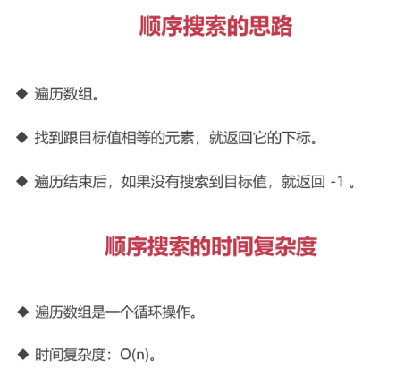

```js
Array.prototype.sequentialSearch = function (target) {
  for (let i = 0; i < this.length; i++) {
    if (this[i] === target) {
      return i;
    }
  }
  return -1;
};

const arr = [5, 3, 8, 4, 2];
console.log(arr.sequentialSearch(8)); // 2
console.log(arr.sequentialSearch(10)); // -1
```

**JavaScript 实现：二分搜索**

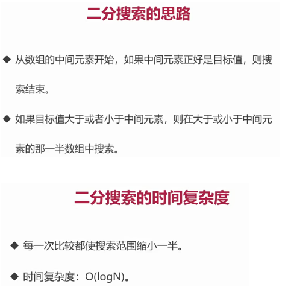

```js
Array.prototype.binarySearch = function (target) {
  let low = 0;
  let high = this.length - 1;

  while (low <= high) {
    const mid = Math.floor((low + high) / 2);
    if (this[mid] === target) {
      return mid;
    } else if (this[mid] < target) {
      low = mid + 1;
    } else {
      high = mid - 1;
    }
  }
  return -1;
};

const arr = [5, 3, 8, 4, 2];
console.log(arr.binarySearch(8)); // 2
console.log(arr.binarySearch(10)); // -1
```

[21.合并两个有序链表](https://leetcode.cn/problems/merge-two-sorted-lists/)

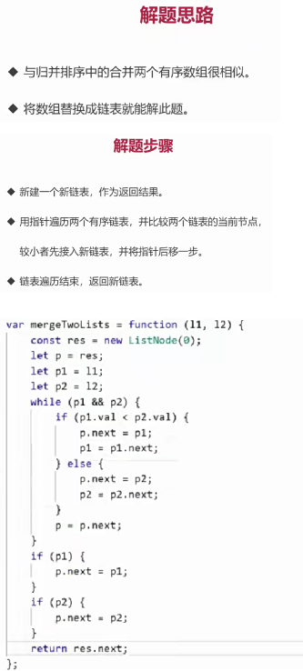

[374.猜数字大小](https://leetcode.cn/problems/guess-number-higher-or-lower/)

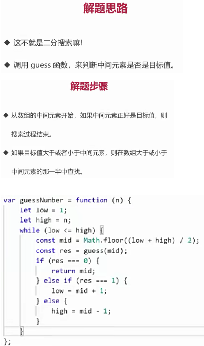

### 12.分而治之(思想)

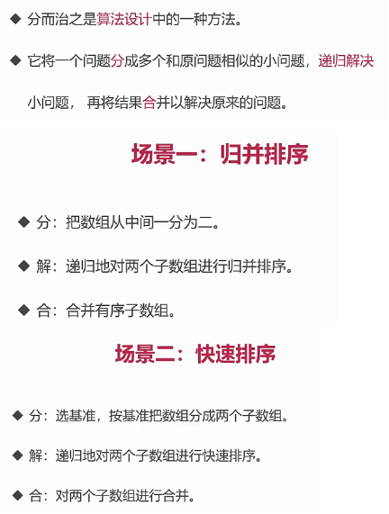

[374.猜数字大小](https://leetcode.cn/problems/guess-number-higher-or-lower/)

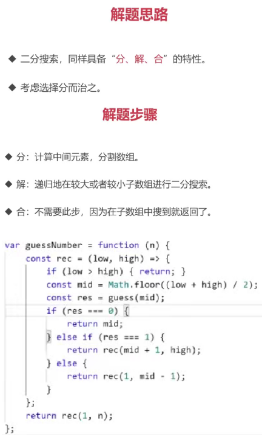

[226. 翻转二叉树](https://leetcode.cn/problems/invert-binary-tree/)

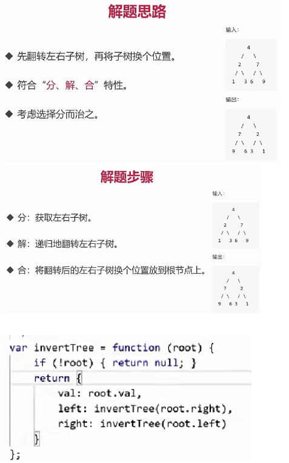

[100. 相同的树](https://leetcode.cn/problems/same-tree/)

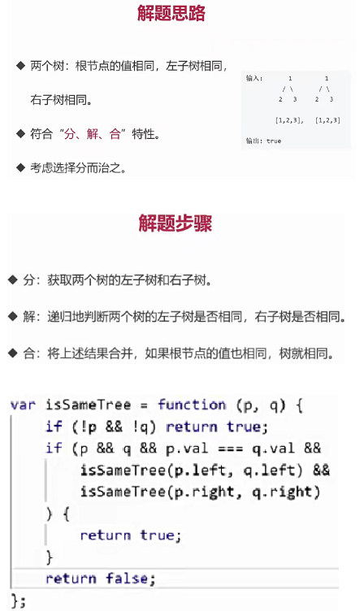

[101. 对称二叉树](https://leetcode.cn/problems/symmetric-tree/)

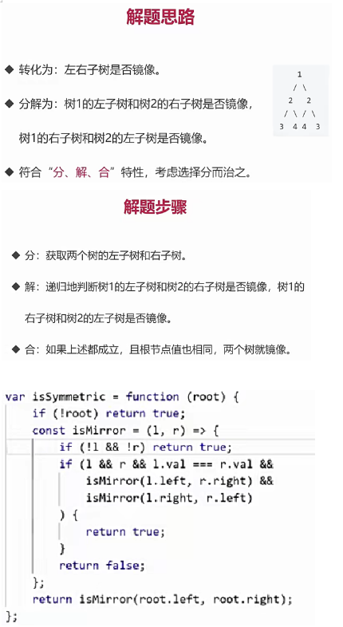
