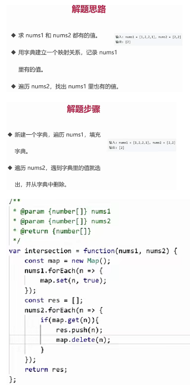

### 1.理论


### 2.时间、空间复杂度

时间复杂度：

1. 一个函数，用大 O 表示，比如 O(1)、O(n)、O(logN)....
2. 定性描述该算法的运行时间

O(1)

```js
let i = 0;
i += 1;
```

O(n)

```js
for (let i = 0; i < n; i += 1) {
  console.log(i);
}
```

O(1) + O(n) = O(n)

```js
let i = 0;
i += 1;
for (let j = 0; j < n; j += 1) {
  console.log(j);
}
```

O(n) \* O(n) = O(n^2)

```js
for (let i = 0; i < n; i += 1) {
  for (let j = 0; j < n; j += 1) {
    console.log(i, j);
  }
}
```

O(logN)

```js
let i = 1;
while (i <= n) {
  console.log(i);
  i *= 2;
}
```

空间复杂度：

1. 一个函数，用大 O 表示，比如 O(1)、O(n)、O(n^2)....
2. 算法在运行过程中临时占用存储空间大小的量度

O(1)

```js
let i = 0;
i += 1;
```

O(n)

```js
let arr = [];
for (let i = 0; i < n; i += 1) {
  arr.push(i);
}
```

O(n^2)

```js
let matrix = [];
for (let i = 0; i < n; i += 1) {
  matrix.push([]);
  for (let j = 0; j < n; j += 1) {
    matrix[i].push(j);
  }
}
```

### 3.栈


```js
let stack = [];
stack.push(1);
stack.push(2);
stack.pop(); // 2
stack.pop(); // 1
```

**栈的应用场景：需要后进先出的场景**

1. 函数调用
2. 括号匹配
3. 撤销重做
4. 浏览器前进后退
5. 迷宫求解
6. 十进制转二进制
7. 判断字符串的括号是否有效

  

[20.有效的括号](https://leetcode.cn/problems/valid-parentheses/description/)


### 4.队列


```js
let queue = [];
queue.push(1);
queue.push(2);
queue.shift(); // 1
queue.shift(); // 2
```

**队列的应用场景：需要先进先出的场景**

1. 线程池
2. 消息队列
3. 浏览器页面
4. 食堂打饭
5. JS 异步中的任务队列
6. 计算最近请求次数


[933.最近的请求次数](https://leetcode.cn/problems/number-of-recent-calls/)


### 5.链表

 

```js
const a = { val: 'a' };
const b = { val: 'b' };
const c = { val: 'c' };
const d = { val: 'd' };
a.next = b;
b.next = c;
c.next = d;

// 遍历链表
let p = a;
while (p) {
  console.log(p.val);
  p = p.next;
}

// 插入
const e = { val: 'e' };
c.next = e;
e.next = d;

// 删除
c.next = d;
```

[237.删除链表中的节点](https://leetcode.cn/problems/delete-node-in-a-linked-list/)


[206.反转链表](https://leetcode.cn/problems/reverse-linked-list/)


[2.两数相加](https://leetcode.cn/problems/add-two-numbers/)


[83.删除排序链表中的重复元素](https://leetcode.cn/problems/remove-duplicates-from-sorted-list/)


[141.环形链表](https://leetcode.cn/problems/linked-list-cycle/)


**前端与链表：JS 中的原型链**


**instanceof 的原理，并用代码实现。**


**前端与链表：使用链表指针获取 JSON 的节点值**

```js
const json = {
  a: { b: { c: 1 } },
  d: { e: 2 },
};

const path = ['a', 'b', 'c'];

let p = json;
path.forEach(k => {
  p = p[k];
});
```

### 6.集合


```js
// 去重
const arr = [1, 1, 2, 2];
const arr2 = [...new Set(arr)];

// 判断元素是否在集合中
const set = new Set(arr);
const has = set.has(3);

// 求交集
const set2 = new Set([2, 3]);
const set3 = new Set([...set].filter(item => set2.has(item)));
```

[349.两个数组的交集](https://leetcode.cn/problems/intersection-of-two-arrays/)


**前端与集合：使用 ES6 的 Set**


```js
let mySet = new Set();

mySet.add(1);
mySet.add(5);
mySet.add(5);
mySet.add('some text');
let o = { a: 1, b: 2 };
mySet.add(o);
mySet.add({ a: 1, b: 2 });

const has = mySet.has(o);

mySet.delete(5);

for (let [key, value] of mySet.entries()) console.log(key, value);

const myArr = Array.from(mySet);

const mySet2 = new Set([1, 2, 3, 4]);

const intersection = new Set([...mySet].filter(x => mySet2.has(x)));
const difference = new Set([...mySet].filter(x => !mySet2.has(x)));
```

### 7.字典


```js
const m = new Map();

// 增
m.set('a', 'aa');
m.set('b', 'bb');

// 删
m.delete('b');
// m.clear();

// 改
m.set('a', 'aaa');
```

[349.两个数组的交集](https://leetcode.cn/problems/intersection-of-two-arrays/)



[20.有效的括号](https://leetcode.cn/problems/valid-parentheses/description/)


[1.两数之和](https://leetcode.cn/problems/two-sum/)


[3.无重复字符的最长子串](https://leetcode.cn/problems/longest-substring-without-repeating-characters/)


[76.最小覆盖子串](https://leetcode.cn/problems/minimum-window-substring/)


### 8.树


**树的其他常用操作:深度/广度优先遍历、先中后序遍历**


**二叉树的先中后序遍历**


```js
const bt = {
  val: 1,
  left: {
    val: 2,
    left: {
      val: 4,
      left: null,
      right: null,
    },
    right: {
      val: 5,
      left: null,
      right: null,
    },
  },
  right: {
    val: 3,
    left: {
      val: 6,
      left: null,
      right: null,
    },
    right: {
      val: 7,
      left: null,
      right: null,
    },
  },
};
module.exports = bt;
```

```js
const bt = require('./bt');

const preorder = root => {
  if (!root) {
    return;
  }
  console.log(root.val);
  preorder(root.left);
  preorder(root.right);
};

// const preorder = (root) => {
//     if (!root) { return; }
//     const stack = [root];
//     while (stack.length) {
//         const n = stack.pop();
//         console.log(n.val);
//         if (n.right) stack.push(n.right);
//         if (n.left) stack.push(n.left);
//     }
// };

preorder(bt);
```


```js
const bt = require('./bt');

const inorder = root => {
  if (!root) {
    return;
  }
  inorder(root.left);
  console.log(root.val);
  inorder(root.right);
};

// const inorder = (root) => {
//     if (!root) { return; }
//     const stack = [];
//     let p = root;
//     while (stack.length || p) {
//         while (p) {
//             stack.push(p);
//             p = p.left;
//         }
//         const n = stack.pop();
//         console.log(n.val);
//         p = n.right;
//     }
// };

inorder(bt);
```


```js
const bt = require('./bt');

const postorder = root => {
  if (!root) {
    return;
  }
  postorder(root.left);
  postorder(root.right);
  console.log(root.val);
};

// const postorder = (root) => {
//     if (!root) { return; }
//     const outputStack = [];
//     const stack = [root];
//     while (stack.length) {
//         const n = stack.pop();
//         outputStack.push(n);
//         if (n.left) stack.push(n.left);
//         if (n.right) stack.push(n.right);
//     }
//     while(outputStack.length){
//         const n = outputStack.pop();
//         console.log(n.val);
//     }
// };

postorder(bt);
```

[104.二叉树的最大深度](https://leetcode.cn/problems/maximum-depth-of-binary-tree/)


[111.二叉树的最小深度](https://leetcode.cn/problems/minimum-depth-of-binary-tree/)


[102. 二叉树的层序遍历](https://leetcode.cn/problems/binary-tree-level-order-traversal/description/)


[94. 二叉树的中序遍历](https://leetcode.cn/problems/binary-tree-inorder-traversal/)


[112. 路径总和](https://leetcode.cn/problems/path-sum/)


**前端与树:遍历 JSON 的所有节点值**

```js
const json = {
  a: { b: { c: 1 } },
  d: [1, 2],
};

const dfs = (n, path) => {
  console.log(n, path);
  Object.keys(n).forEach(k => {
    dfs(n[k], path.concat(k));
  });
};

dfs(json, []);
```

**前端与树:渲染 Antd 的树组件**


