# JavaScript

## 1.简述对闭包的理解，以及其优缺点

闭包：函数执行产生一个不被释放的私有的上下文，这样不仅保护里面的私有变量不受污染，而且还可以把这些信息存储下来「保护+保存」

1. 理论知识：  
   根据 v8 执行机制，函数执行时产生 `私有上下文EC（Execution Context ）`，进栈执行，声明的变量都保存在 `变量对象AO（Active Object）`中，首先`初始化作用域链`、`形参赋值`、`变量提升`以及`代码执行`，正常情况下代码执行完`出栈释放`，但是由于`浏览器垃圾回收机制`，导致当前上下文中的某个变量被上下文之外的东西占用，不能被释放，这样就形成了`闭包`，所以说私有变量不受外面干扰和污染，另一方面也把这些东西保存下来了，这也是闭包的两大作用吧，保存和保护。
2. 结合实战闭包在项目中无时无刻不存在，在项目中经常使用，举例（如循环绑定事件。。。）
3. 深入研究之前研究 JS，基于闭包能实现很多的函数技巧，如 JS 高级编程技巧：单例模式（工具方法库）、惰性思想、柯理化、compose 组合函数
4. 插件和源码 JQ 源码里也有用到闭包（工厂函数），Lodash 源码、Redux 源码，类库和组件的封装。。。

`综述`：  
所以我认为闭包就是 JS 底层的机制，在开发过程中无时无刻不在使用，但是闭包消耗的内存比较大，所以要合理使用。。。

## 2.for 循环和 forEach 的区别

1. for 循环代表的是命令是编程、forEach 代表的是函数式编程；
2. forEach 其实就是把数组迭代的操作步骤封装好，这样我们应用起来会更加方便；我之前研究过 forEach 等数组常见方法的源码，forEach 内部是依次迭代数组每一项，每一次迭代把传递的回调函数执行，把迭代的内容及索引传递给回调函数....直到整个数组都迭代完毕才结束，不支持中间以任何形式跳过或者结束迭代操作！！而 for 循环是命令式编程，所有的操作步骤自己可以管控，想啥时候结束就结束，想咋循环就咋循环；
3. 我在项目开发的时候，一般应用的都是 forEach，这样可以提高我的开发效率，减少代码的冗余！！但是遇到一些需要灵活迭代的需求，则自己基于 for 循环操作！！

```js
Array.prototype.forEach = function forEach(callback) {
  for (let i = 0; i < this.length; i++) {
    callback(this[i], i);
  }
};
```

## 3.let const 和 var 的区别

`和GO的关系`  
`变量提升`  
`重复声明`  
`块级作用域`  
`暂时性死区`

1. let 不存在变量提升,不允许在定义之前使用
2. let 不允许重复声明「不论当前上下文中，基于何种方式声明过这个变量，都不允许基于 let 再次声明」
3. 在全局上下文中，基于 var/function 声明的变量，是给 window(GO)设置的全局属性；基于 let/const 声明的变量是放在 VO(G)中的，和 GO 没有任何的关系；
4. let 会产生块级上下文
5. let 的暂时性死区问题

   ```js
   console.log(typeof a);
   // "undefined" 基于typeof检测一个未被声明的变量，结果不会抱错，而是"undefined"

   console.log(typeof a);
   // Uncaught ReferenceError: Cannot access 'a' before initialization
   let a = 100;
   ```

6. 基于 const 声明的变量，后期不允许更改其指针指向（也就是不能重新赋值为其他的值）;

```js
const a; // Uncaught SyntaxError: Missing initializer in const declaration

const a = 12;
a = 13; // Uncaught TypeError: Assignment to constant variable

const obj = { name: 'abc' };
obj.name = 'edf';
console.log(obj); // {name: 'edf'}
```

## 4.防抖和节流

公用函数

```js
const clearTimer = timer => {
  timer ? clearTimeout(timer) : '';
  return null;
};
```

防抖：用户频繁进行某项操作的时候，只识别一次「自定义频繁的规则、自定义触发边界...」

```js
const debounce = (fn, wait = 300, immediate = false) => {
  let timer = null;
  return (...params) => {
    let now = !timer && immediate;
    timer = clearTimer(timer);
    timer = setTimeout(() => {
      timer = clearTimer(timer);
      !immediate ? fn.apply(this, params) : '';
    }, wait);
    if (now) return fn.apply(this, params);
  };
};
```

节流：“降频”，用户频繁进行某项操作的时候，降低默认的触发频率

```js
const throttle = (fn, wait = 300) => {
  let timer = null,
    previous = 0;
  return (...params) => {
    let now = +new Date();
    let remaining = wait - (now - previous);
    if (remaining <= 0) {
      timer = clearTimer(timer);
      previous = +new Date();
      fn.apply(this, params);
    } else {
      if (!timer) {
        timer = clearTimer(timer);
        previous = +new Date();
        timer = setTimeout(() => {
          fn.apply(this, params);
        }, remaining);
      }
    }
  };
};
```

## 5.Object.prototype.hasPubProperty

1. Object.prototype.hasOwnProperty：用来检测是否为私有属性  
   语法：[对象].hasOwnProperty([属性])  
   检测[属性]是否为[对象]的私有属性，是返回 TRUE，不是则返回 FALSE；只看私有中有没有(和公有不存在没关系)

2. in 操作符  
   语法：[属性] in [对象]  
   检测[属性]是否率属于这个[对象]，不论公有还是私有，只要能访问到这个属性，则结果就是 TRUE

思路 1(不准确)：

```js
Object.prototype.hasPubProperty = function hasPubProperty(attr) {
  // 思路：是对象的属性，而且还不是私有的属性，这样只能是公有属性了
  // 问题：如果attr既是私有的属性，也是公有的属性，基于这种方案检测结果是false
  return attr in this && !this.hasOwnProperty(attr);
};
```

思路 2(准确)：

```js
Object.prototype.hasPubProperty = function hasPubProperty(attr) {
  // this->obj要处理的对象  attr->'toString'要检测的属性
  // 思路：跳过私有属性的查找，直接在公有属性中查找，看看是否存在
  // Object.getPrototypeOf([实例对象])：
  // 获取当前实例对象的原型对象(或者获取“实例对象.__proto__”)
  let proto = Object.getPrototypeOf(this);
  while (proto) {
    if (proto.hasOwnProperty(attr)) return true;
    proto = Object.getPrototypeOf(proto);
  }
  return false;
};
let obj = {
  name: 'leon',
  age: 13,
  toString() {}
};
console.log(obj.hasPubProperty('toString')); //true
```

## 6.call、apply 和 bind

Function.prototype

- call
- apply
- bind  
  所有的函数都是 Function 类的实例，所以所有函数都可以调用这三个方法；而这个三个方法都是用来改变函数中的 THIS 指向的；

call VS apply

- 都是把函数立即执行，改变函数中的 this 指向的「第一个参数是谁，就把 this 改为谁」
- 唯一区别：apply 要求把传递给函数的实参，以数组的形式管理起来「最终效果和 call 一样，也是把数组中每一项，一个个的传给函数」
- 真实项目中建议大家使用 call，因为其性能好一些「做过测试：三个及以上参数，call 的性能明显比 apply 好一些」

call VS bind

- call 是把函数立即执行，而 bind 只是预处理函数中的 this 和参数，函数此时并没有执行

`call`

```js
Function.prototype.call = function call(context, ...params) {
  if (context == null) context = window;
  if (!/^(object|function)$/.test(typeof context)) context = Object(context);
  let key = Symbol('KEY'),
    result;
  context[key] = this;
  result = context[key](...params);
  Reflect.deleteProperty(context, key);
  return result;
};
const fn = function fn(x, y) {
  console.log(this, x, y);
  return x + y;
};
let obj = {
  name: 'obj'
};
let res = fn.call('leon', 10, 20);
console.log(res);
```

`bind`

```js
Function.prototype.bind = function bind(context, ...params) {
  return (...args) => {
    params = params.concat(args);
    return this.call(context, ...params);
  };
};
```

## 7.跨域解决方案

- 修改本地 HOST
- JSONP
- CORS
- Proxy
- ……

### JSONP

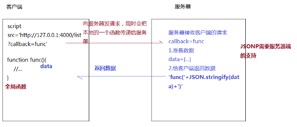

服务端代码

```js
/*-CREATE SERVER-*/
const express = require('express'),
  app = express();
app.listen(1001, () => {
  console.log(
    `THE WEB SERVICE IS CREATED SUCCESSFULLY AND IS LISTENING TO THE PORT：1001`
  );
});

app.get('/user/list', (req, res) => {
  let { callback } = req.query;
  // callback存储的就是客户端传递的全局函数名
  let result = {
    code: 0,
    data: ['张三', '李四']
  };
  // 返回给客户端指定的格式
  res.send(`${callback}(${JSON.stringify(result)})`);
});

/* STATIC WEB */
app.use(express.static('./'));
```

客户端处理

```js
(function () {
  // 检测是否为纯粹对象
  const isPlainObject = function isPlainObject(obj) {
    let proto, Ctor;
    if (!obj || Object.prototype.toString.call(obj) !== '[object Object]')
      return false;
    proto = Object.getPrototypeOf(obj);
    if (!proto) return true;
    Ctor = proto.hasOwnProperty('constructor') && proto.constructor;
    return typeof Ctor === 'function' && Ctor === Object;
  };

  // 把普通对象变为URLENCODED格式字符串
  const stringify = function stringify(obj) {
    let str = ``,
      keys = Object.keys(obj).concat(Object.getOwnPropertySymbols(obj));
    keys.forEach(key => {
      str += `&${key}=${obj[key]}`;
    });
    return str.substring(1);
  };

  /* 封装JSONP函数 */
  const jsonp = function jsonp(url, config) {
    return new Promise((resolve, reject) => {
      // 初始化参数
      if (typeof url !== 'string') throw new TypeError('url is not a string!');
      if (!isPlainObject(config)) config = {};
      config = Object.assign(
        {
          params: null,
          jsonp: 'callback'
        },
        config
      );

      // 创建一个全局函数
      let f_name = `jsonp${+new Date()}`;
      window[f_name] = value => {
        // 请求成功
        resolve(value);
        delete window[f_name];
        document.body.removeChild(script);
      };

      // 处理URL「拼接问号参数 & 拼接函数名」
      let params = config.params;
      if (params) {
        if (isPlainObject(params)) params = stringify(params);
        url += `${url.includes('?') ? '&' : '?'}${params}`;
      }
      url += `${url.includes('?') ? '&' : '?'}${config.jsonp}=${f_name}`;

      // 发送请求
      let script = document.createElement('script');
      script.src = url;
      script.onerror = err => {
        // 请求失败
        reject(err);
      };
      document.body.appendChild(script);
    });
  };

  /* 暴露API */
  if (typeof module === 'object' && typeof module.exports === 'object')
    module.exports = jsonp;
  if (typeof window !== 'undefined') window.jsonp = jsonp;
})();
```

JSONP 测试代码

```js
<script>
    (function () {
        window['fn'] = function fn(result) {
            console.log(result);
        };
    })();
</script>
<script src="https://www.baidu.com/sugrec?prod=pc&wd=标题&cb=fn"></script>

<script src="jsonp.js"></script>
    <script>
    jsonp('https://www.baidu.com/sugrec', {
        params: {
            prod: 'pc',
            wd: '哈哈哈'
        },
        jsonp: 'cb'
    }).then(value => {
        console.log(value);
    });

    jsonp('http://127.0.0.1:1001/user/list').then(value => {
        console.log(value);
    });
</script>
```

### CORS

服务器端代码

```js
/*-CREATE SERVER-*/
const express = require('express'),
  app = express();
app.listen(1001, () => {
  console.log(
    `THE WEB SERVICE IS CREATED SUCCESSFULLY AND IS LISTENING TO THE PORT：1001`
  );
});

/*-MIDDLE WARE-*/
// 设置白名单
let safeList = [
  'http://127.0.0.1:5500',
  'http://127.0.0.1:3000',
  'http://127.0.0.1:8080'
];
app.use((req, res, next) => {
  let origin = req.headers.origin || req.headers.referer || '';
  origin = origin.replace(/\/$/g, '');
  origin = !safeList.includes(origin) ? '' : origin;
  res.header('Access-Control-Allow-Origin', origin);
  res.header('Access-Control-Allow-Credentials', true);
  res.header(
    'Access-Control-Allow-Headers',
    'Content-Type,Content-Length,Authorization, Accept,X-Requested-With'
  );
  res.header('Access-Control-Allow-Methods', 'PUT,POST,GET,DELETE,OPTIONS,HEAD');
  req.method === 'OPTIONS' ? res.send('OK') : next();
});

/*-API-*/
app.get('/list', (req, res) => {
  res.send({
    code: 0,
    message: 'zhufeng'
  });
});

/* STATIC WEB */
app.use(express.static('./'));
```

客户端

```js
axios
  .get('http://127.0.0.1:1001/list', {
    withCredentials: true
  })
  .then(response => {
    console.log(response);
  });
```

### Proxy

服务端

```js
/*-CREATE SERVER-*/
const express = require('express'),
  app = express();
app.listen(1001, () => {
  console.log(
    `THE WEB SERVICE IS CREATED SUCCESSFULLY AND IS LISTENING TO THE PORT：1001`
  );
});

// 代理
const request = require('request');
app.get('/asimov/subscriptions/recommended_collections', (req, res) => {
  let jianURL = `https://www.jianshu.com${req.url}`;
  req.pipe(request(jianURL)).pipe(res);
});

/* STATIC WEB */
app.use(express.static('./'));
```

客户端

```js
axios.get('/asimov/subscriptions/recommended_collections').then(response => {
  console.log(response.data);
});
```

## 8.事件循环

### 何为进程

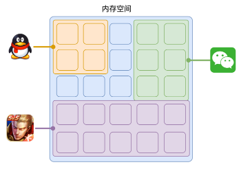

程序运行需要有它自己专属的内存空间，可以把这块内存空间简单的理解为进程，每个应用至少有一个进程，进程之间相互独立，即使要通信，也需要双方同意。

### 何为线程

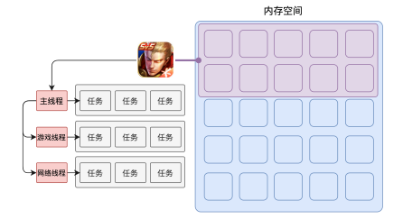

有了进程后，就可以运行程序的代码了。

运行代码的「人」称之为「线程」。

一个进程至少有一个线程，所以在进程开启后会自动创建一个线程来运行代码，该线程称之为主线程。

如果程序需要同时执行多块代码，主线程就会启动更多的线程来执行代码，所以一个进程中可以包含多个线程。

### 浏览器有哪些进程和线程

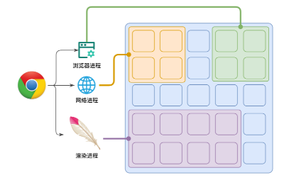

可以在浏览器的任务管理器中查看当前的所有进程，其中，最主要的进程有：

1. 浏览器进程

   主要负责界面显示、用户交互、子进程管理等。浏览器进程内部会启动多个线程处理不同的任务。

2. 网络进程

   负责加载网络资源。网络进程内部会启动多个线程来处理不同的网络任务。

3. **渲染进程**（本节课重点讲解的进程）

   渲染进程启动后，会开启一个**渲染主线程**，主线程负责执行 HTML、CSS、JS 代码。

   默认情况下，浏览器会为每个标签页开启一个新的渲染进程，以保证不同的标签页之间不相互影响。

> 将来该默认模式可能会有所改变，有兴趣的可参见[chrome 官方说明文档](https://chromium.googlesource.com/chromium/src/+/main/docs/process_model_and_site_isolation.md#Modes-and-Availability)

### 渲染主线程是如何工作的

渲染主线程是浏览器中最繁忙的线程，需要它处理的任务包括但不限于：

- 解析 HTML
- 解析 CSS
- 计算样式
- 布局
- 处理图层
- 每秒把页面画 60 次
- 执行全局 JS 代码
- 执行事件处理函数
- 执行计时器的回调函数
- ......

要处理这么多的任务，主线程遇到了一个前所未有的难题：如何调度任务？

比如：

- 我正在执行一个 JS 函数，执行到一半的时候用户点击了按钮，我该立即去执行点击事件的处理函数吗？
- 我正在执行一个 JS 函数，执行到一半的时候某个计时器到达了时间，我该立即去执行它的回调吗？
- 浏览器进程通知我“用户点击了按钮”，与此同时，某个计时器也到达了时间，我应该处理哪一个呢？
- ......

渲染主线程想出了一个绝妙的主意来处理这个问题：排队

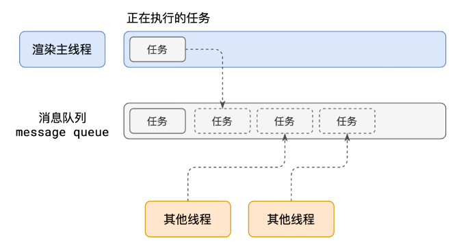

1. 在最开始的时候，渲染主线程会进入一个无限循环
2. 每一次循环会检查消息队列中是否有任务存在。如果有，就取出第一个任务执行，执行完一个后进入下一次循环；如果没有，则进入休眠状态。
3. 其他所有线程（包括其他进程的线程）可以随时向消息队列添加任务。新任务会加到消息队列的末尾。在添加新任务时，如果主线程是休眠状态，则会将其唤醒以继续循环拿取任务

这样一来，就可以让每个任务有条不紊的、持续的进行下去了。

**整个过程，被称之为事件循环（消息循环）**

### 何为异步

代码在执行过程中，会遇到一些无法立即处理的任务，比如：

- 计时完成后需要执行的任务 —— `setTimeout`、`setInterval`
- 网络通信完成后需要执行的任务 -- `XHR`、`Fetch`
- 用户操作后需要执行的任务 -- `addEventListener`

如果让渲染主线程等待这些任务的时机达到，就会导致主线程长期处于「阻塞」的状态，从而导致浏览器「卡死」

**渲染主线程承担着极其重要的工作，无论如何都不能阻塞！**

因此，浏览器选择**异步**来解决这个问题

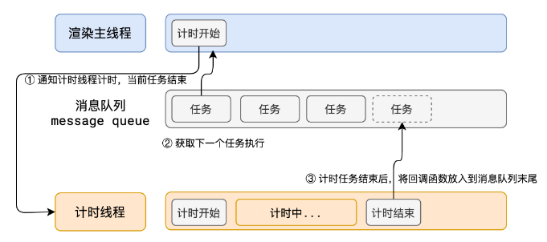

### a.面试题：如何理解 JS 的异步

JS 是一门单线程的语言，这是因为它运行在浏览器的渲染主线程中，而渲染主线程只有一个。

而渲染主线程承担着诸多的工作，渲染页面、执行 JS 都在其中运行。

如果使用同步的方式，就极有可能导致主线程产生阻塞，从而导致消息队列中的很多其他任务无法得到执行。这样一来，一方面会导致繁忙的主线程白白的消耗时间，另一方面导致页面无法及时更新，给用户造成卡死现象。

所以浏览器采用异步的方式来避免。具体做法是当某些任务发生时，比如计时器、网络、事件监听，主线程将任务交给其他线程去处理，自身立即结束任务的执行，转而执行后续代码。当其他线程完成时，将事先传递的回调函数包装成任务，加入到消息队列的末尾排队，等待主线程调度执行。

在这种异步模式下，浏览器永不阻塞，从而最大限度的保证了单线程的流畅运行。

### 任务有优先级吗

任务没有优先级，在消息队列中先进先出

但**消息队列是有优先级的**

根据 W3C 的最新解释:

- 每个任务都有一个任务类型，同一个类型的任务必须在一个队列，不同类型的任务可以分属于不同的队列。在一次事件循环中，浏览器可以根据实际情况从不同的队列中取出任务执行。
- 浏览器必须准备好一个微队列，微队列中的任务优先所有其他任务执行 https://html.spec.whatwg.org/multipage/webappapis.html#perform-a-microtask-checkpoint

> 随着浏览器的复杂度急剧提升，W3C 不再使用宏队列的说法

在目前 chrome 的实现中，至少包含了下面的队列：

- 延时队列：用于存放计时器到达后的回调任务，优先级「中」
- 交互队列：用于存放用户操作后产生的事件处理任务，优先级「高」
- 微队列：用户存放需要最快执行的任务，优先级「最高」

> 添加任务到微队列的主要方式主要是使用 Promise、MutationObserver

### b.面试题：阐述一下 JS 的事件循环

事件循环又叫做消息循环，是浏览器渲染主线程的工作方式。

在 Chrome 的源码中，它开启一个不会结束的 for 循环，每次循环从消息队列中取出第一个任务执行，而其他线程只需要在合适的时候将任务加入到队列末尾即可。

过去把消息队列简单分为宏队列和微队列，这种说法目前已无法满足复杂的浏览器环境，取而代之的是一种更加灵活多变的处理方式。

根据 W3C 官方的解释，每个任务有不同的类型，同类型的任务必须在同一个队列，不同的任务可以属于不同的队列。不同任务队列有不同的优先级，在一次事件循环中，由浏览器自行决定取哪一个队列的任务。但浏览器必须有一个微队列，微队列的任务一定具有最高的优先级，必须优先调度执行。

### c.面试题：JS 中的计时器能做到精确计时吗？为什么？

1. 计算机硬件没有原子钟，无法做到精确计时
2. 操作系统的计时函数本身就有少量偏差，由于 JS 的计时器最终调用的是操作系统的函数，也就携带了这些偏差
3. 按照 W3C 的标准，浏览器实现计时器时，如果嵌套层级超过 5 层，则会带有 4 毫秒的最少时间，这样在计时时间少于 4 毫秒时又带来了偏差
4. 受事件循环的影响，计时器的回调函数只能在主线程空闲时运行，因此又带来了偏差

## 9.浏览器渲染原理

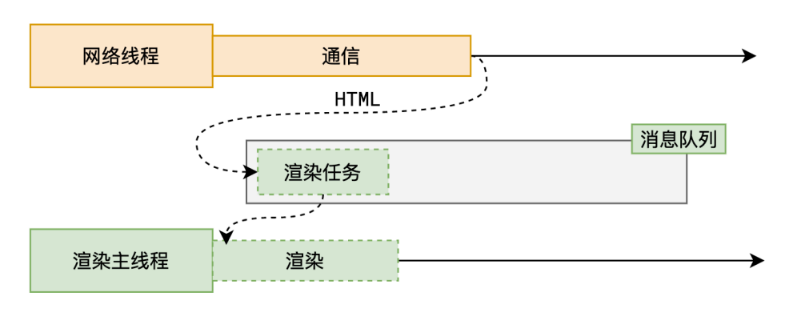

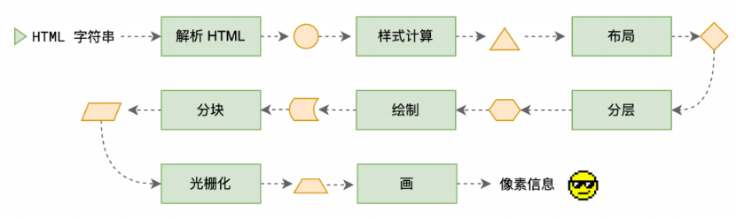

### 1. 解析 HTML - Parse HTML

生成 DOM （document object model） 树，CSSOM (css object model) 树 「document.styleSheets」

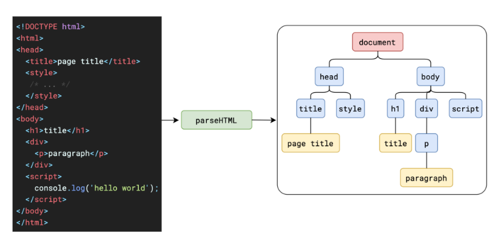

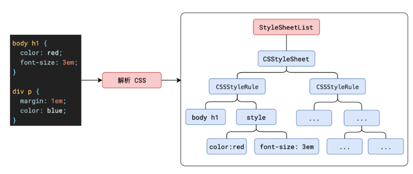

HTML 解析过程中遇到 CSS 代码怎么办？

为了提⾼解析效率，浏览器会启动⼀个预解析器率先下载和解析 CSS

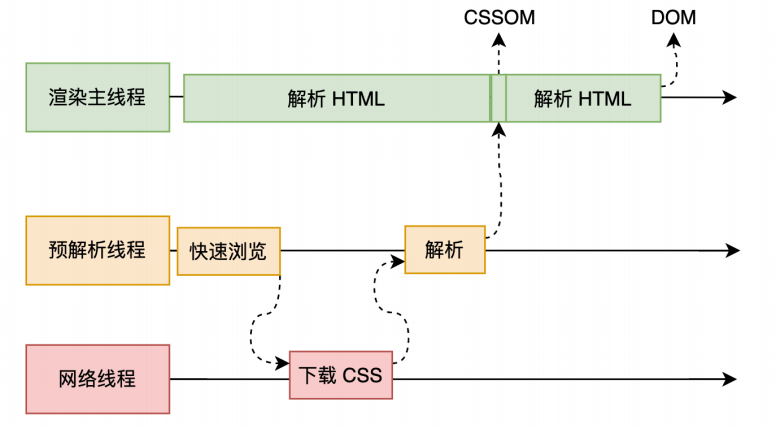

HTML 解析过程中遇到 JS 代码怎么办？

渲染主线程遇到 JS 时必须暂停⼀切⾏为，等待下载执⾏完后才能继续，预解析线程可以分担⼀点下载 JS 的任务

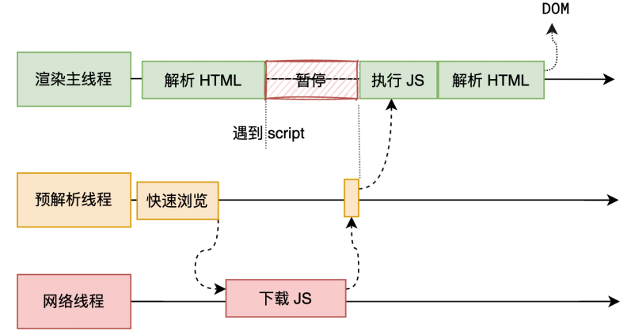

### 2.样式计算-Computed Style

主线程会遍历得到的 DOM 树，依次为树中的每个节点计算出它的最终样式，得到带有样式的 DOM 树。

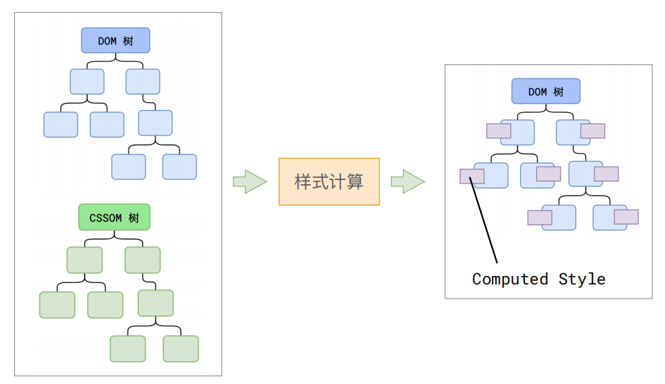

### 3.布局-Layout

DOM 树和 Layout 树不一定一一对应

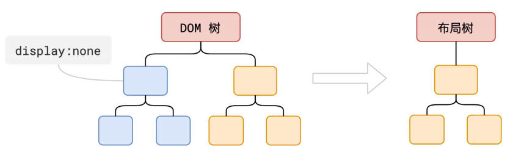

### 4.分层-Layer

主线程会使用一套复杂的策略对整个布局树中进行分层。

分层的好处在于，将来某一个层改变后，仅会对该层进行后续处理，从而提升效率。

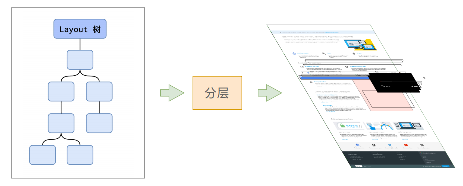

### 5.绘制-Paint

这⾥的绘制，是为每⼀层⽣成类似 canvas 的绘制指令

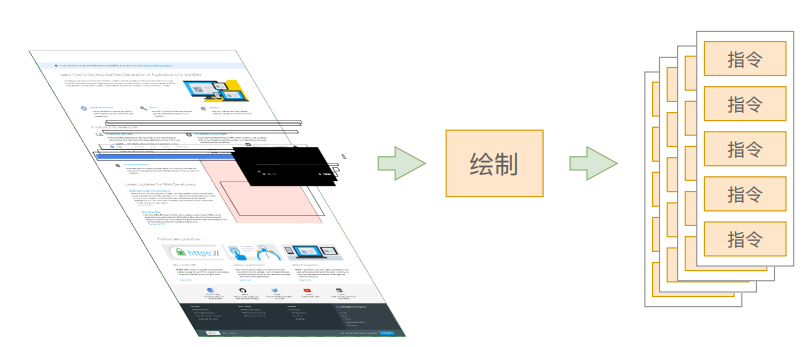

渲染主线程的⼯作到此为⽌，剩余步骤交给其他线程完成

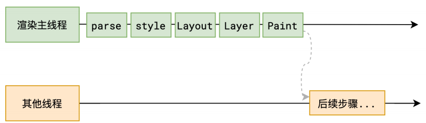

### 6.分块-Tiling

分块会将每⼀层分为多个⼩的区域

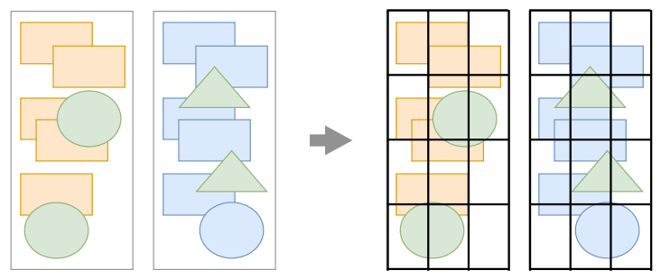

分块的⼯作是交给多个线程同时进⾏的

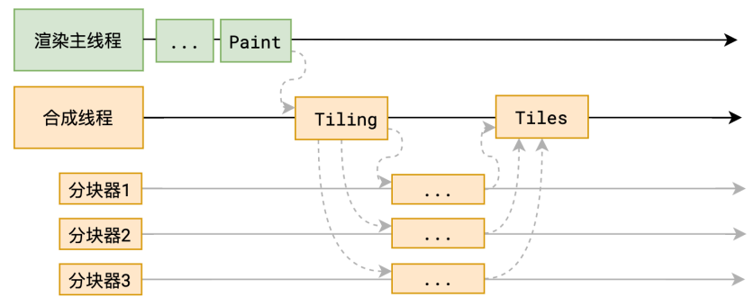

### 7.光栅化-Raster

光栅化是将每个块变成位图

优先处理靠近视⼝的块

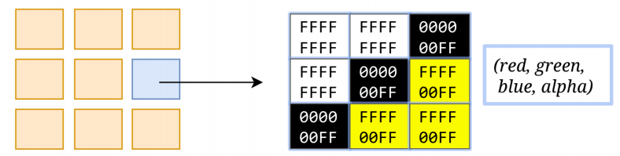

此过程会⽤到 GPU 加速

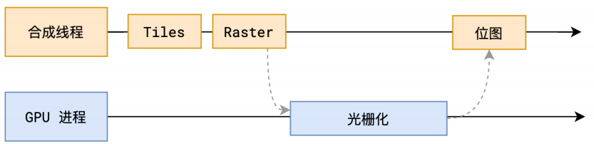

### 8.画-Draw

合成线程拿到每个层、每个块的位图后，生成一个个「指引（quad）」信息。

指引会标识出每个位图应该画到屏幕的哪个位置，以及会考虑到旋转、缩放等变形。

变形发生在合成线程，与渲染主线程无关，这就是`transform`效率高的本质原因。

合成线程会把 quad 提交给 GPU 进程，由 GPU 进程产生系统调用，提交给 GPU 硬件，完成最终的屏幕成像。

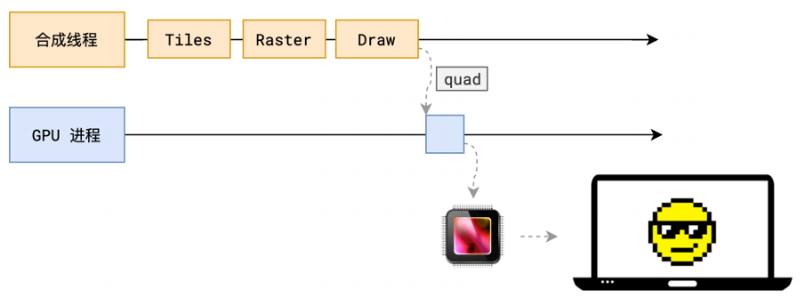

### 完整过程

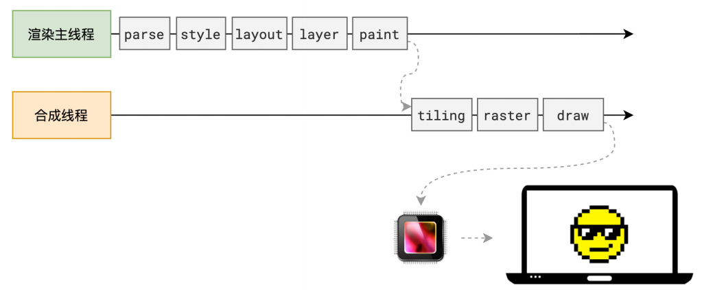

### a.面试题：什么是 reflow

reflow 的本质就是重新计算 layout 树。当进行了会影响布局树的操作后，需要重新计算布局树，会引发 layout。为了避免连续的多次操作导致布局树反复计算，浏览器会合并这些操作，当 JS 代码全部完成后再进行统一计算。所以，改动属性造成的 reflow 是异步完成的。也同样因为如此，当 JS 获取布局属性时，就可能造成无法获取到最新的布局信息。浏览器在反复权衡下，最终决定获取属性立即 reflow。

### b.面试题：什么是 repaint

repaint 的本质就是重新根据分层信息计算了绘制指令。当改动了可见样式后，就需要重新计算，会引发 repaint。由于元素的布局信息也属于可见样式，所以 reflow 一定会引起 repaint。

### c.面试题：为什么 transform 的效率高

因为 transform 既不会影响布局也不会影响绘制指令，它影响的只是渲染流程的最后一个「draw」阶段，由于 draw 阶段在合成线程中，所以 transform 的变化几乎不会影响渲染主线程。反之，渲染主线程无论如何忙碌，也不会影响 transform 的变化。
