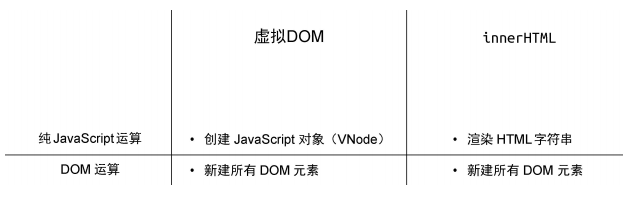
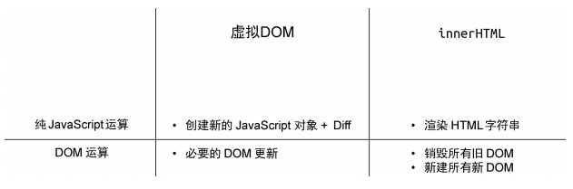
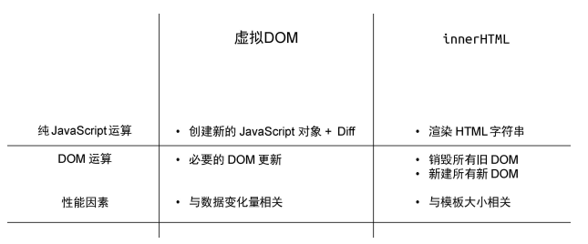
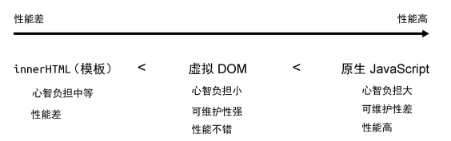
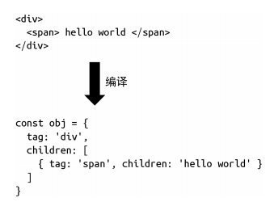
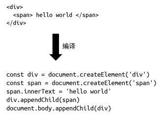
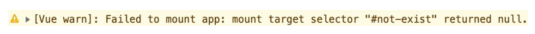
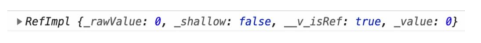
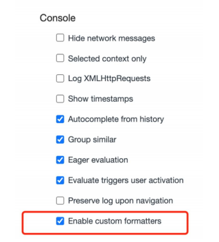
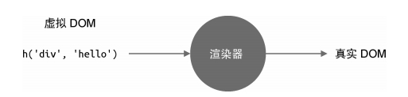

# Vue.js 设计与实现

## 1.权衡的艺术

### 1.1 命令式和声明式

早年间流行的 jQuery 就是典型的命令式框架。命令式框架的一大特点就是**关注过程**。

```js
- 获取 id 为 app 的 div 标签
- 它的文本内容为 hello world
- 为其绑定点击事件
- 当点击时弹出提示：ok

$('#app') // 获取 div
.text('hello world') // 设置文本内容
.on('click', () => { alert('ok') }) // 绑定点击事件

const div = document.querySelector('#app') // 获取 div
div.innerText = 'hello world' // 设置文本内容
div.addEventListener('click', () => { alert('ok') }) // 绑定点击事
```

可以看到，自然语言描述能够与代码产生一一对应的关系，代码本身描述的是“做事的过程”，这符合我们的逻辑直觉。

与命令式框架更加关注过程不同， 声明式框架更加**关注结果**。

```vue
<div @click="() => alert('ok')">hello world</div>
```

Vue.js 帮我们封装了过程。因此，我们能够猜到 Vue.js 的内部实现一定是命令式的，而暴露给用户的却更加声明式。

### 1.2 性能与可维护性的权衡

命令式和声明式各有优缺点，在框架设计方面，则体现在性能与可维护性之间的权衡。这里我们先抛出一个结论： **声明式代码的性能不优于命令式代码的性能。**

将 div 标签的文本内容修改为 hello vue3，那么如何用命令式代码实现呢？

```js
div.textContent = 'hello vue3'; // 直接修改
```

现在思考一下，还有没有其他办法比上面这句代码的性能更好？答案是“没有”。可以看到，**理论上命令式代码可以做到极致的性能优化**。

声明式代码不一定能做到这一点，因为它描述的是结果：

```vue
<!-- 之前： -->
<div @click="() => alert('ok')">hello world</div>
<!-- 之后： -->
<div @click="() => alert('ok')">hello vue3</div>
```

对于框架来说，为了实现最优的更新性能，它需要找到前后的差异并只更新变化的地方，但是最终完成这次更新的代码仍然是：

```js
div.textContent = 'hello vue3'; // 直接修改
```

如果我们把直接修改的性能消耗定义为 A，把找出差异的性能消耗定义为 B，那么有：

- 命令式代码的更新性能消耗 = A
- 声明式代码的更新性能消耗 = B + A

**声明式代码的可维护性更强。**

这就体现了我们在框架设计上要做出的关于可维护性与性能之间的权衡。在采用声明式提升可维护性的同时，性能就会有一定的损失，而框架设计者要做的就是：**在保持可维护性的同时让性能损失最小化**。

### 1.3 虚拟 DOM 的性能到底如何

前文说到，**声明式代码的更新性能消耗 = 找出差异的性能消耗+直接修改的性能消耗**，因此，如果我们能够最小化**找出差异的性能消耗**，就可以让声明式代码的性能无限接近命令式代码的性能。而所谓的虚拟 DOM，就是为了最小化找出差异这一步的性能消耗而出现的。

采用虚拟 DOM 的更新 技术的性能**理论上**不可能比原生 JavaScript 操作 DOM 更高。这里我们 强调了理论上三个字，因为这很关键，为什么呢？因为在大部分情况 下，**我们很难写出绝对优化的命令式代码**，尤其是当应用程序的规模很大的时候，即使你写出了极致优化的代码，也一定耗费了巨大的精力，这时的投入产出比其实并不高。

写声明式代码，还能够**保证应用程序的性能下限**。

**纯 JavaScript 层面的操作要比 DOM 操作快得多**

下图直观地对比了 innerHTML 和虚拟 DOM 在创建页面时的性能。



使用 innerHTML 更新页面的过程是重新构建 HTML 字符串，再重新设置 DOM 元素的 innerHTML 属性，这其实是在说，哪怕我们只更改了一个文字，也要重新设置 innerHTML 属性。而重新设置 innerHTML 属性就等价于销毁所有旧的 DOM 元素，再全量创建新的 DOM 元素。再来看虚拟 DOM 是如何更新页面的。它需要重新创建 JavaScript 对象（虚拟 DOM 树），然后比较新旧虚拟 DOM，找到变化的元素并更新它。



在更新页面时，虚拟 DOM 在 JavaScript 层面的运算要 比创建页面时多出一个 Diff 的性能消耗，然而它毕竟也是 JavaScript 层 面的运算，所以不会产生数量级的差异。再观察 DOM 层面的运算，可 以发现虚拟 DOM 在更新页面时只会更新必要的元素，但 innerHTML 需要全量更新。这时虚拟 DOM 的优势就体现出来了。



虚拟 DOM 和 innerHTML 在更新页面时的性能（加上性能因素）



### 1.4 运行时和编译时

当设计一个框架的时候，我们有三种选择：纯运行时的、运行时 + 编译时的或纯编译时的。

先聊聊**纯运行时的框架**。假设我们设计了一个框架，它提供一个 Render 函数，用户可以为该函数提供一个树型结构的数据对象，然后 Render 函数会根据该对象递归地将数据渲染成 DOM 元素。我们规定树型结构的数据对象如下：

```js
const obj = {
  tag: 'div',
  children: [{ tag: 'span', children: 'hello world' }],
};
```

每个对象都有两个属性：tag 代表标签名称，children 既可以是一个数组（代表子节点），也可以直接是一段文本（代表文本子节点）。接着，我们来实现 Render 函数：

```js
function Render(obj, root) {
  const el = document.createElement(obj.tag);
  if (typeof obj.children === 'string') {
    const text = document.createTextNode(obj.children);
    el.appendChild(text);
  } else if (obj.children) {
    // 数组，递归调用 Render，使用 el 作为 root 参数
    obj.children.forEach(child => Render(child, el));
  }

  // 将元素添加到 root
  root.appendChild(el);
}
```

有了这个函数，用户就可以这样来使用它：

```js
const obj = {
  tag: 'div',
  children: [{ tag: 'span', children: 'hello world' }],
};
// 渲染到 body 下
Render(obj, document.body);
```

手写树型结构的数据对象太麻烦了，而且不直观，能不能支持用类似于 HTML 标签的方式描述树型结构的数据对象呢？”你看了看现在的 Render 函数，然后回答：“抱歉，暂不支持。”实际上，我们刚刚编写的框架就是一个纯运行时的框架。

为了满足用户的需求，你开始思考，能不能引入编译的手段，把 HTML 标签编译成树型结构的数据对象，这样不就可以继续使用 Render 函数了吗？



你编写了一个叫作 Compiler 的程序，它的作用就是把 HTML 字符串编译成树型结构的数据对象，于是交付给用户去用了。那么用户该怎么用呢？其实这也是我们要思考的问题，最简单的方式就是让用户分别调用 Compiler 函数和 Render 函数：

```js
const html = `
 <div>
 <span>hello world</span>
 </div>
 `;
// 调用 Compiler 编译得到树型结构的数据对象
const obj = Compiler(html);
// 再调用 Render 进行渲染
Render(obj, document.body);
```

上面这段代码能够很好地工作，这时我们的框架就变成了一个**运行时 + 编译时**的框架。它既支持运行时，用户可以直接提供数据对象从而无须编译；又支持编译时，用户可以提供 HTML 字符串，我们将其编译为数据对象后再交给运行时处理。准确地说，上面的代码其实是运行时编译，意思是代码运行的时候才开始编译，而这会产生一定的性能开销，因此我们也可以在构建的时候就执行 Compiler 程序将用户提供的内容编译好，等到运行时就无须编译了，这对性能是非常友好的。

既然编译器可以把 HTML 字符串编译成数据对象，那么能不能直接编译成命令式代码呢？



这样我们只需要一个 Compiler 函数就可以了，连 Render 都不需要了。其实这就变成了一个**纯编译时**的框架，因为我们不支持任何运行时内容，用户的代码通过编译器编译后才能运行。

首先是纯运行时的框架。由于它没有编译的过程，因此我们没办法分析用户提供的内容，但是如果加入编译步骤，可能就大不一样了，我们可以分析用户提供的内容，看看哪些内容未来可能会改变，哪些内容永远不会改变，这样我们就可以在编译的时候提取这些信息，然后将其传递给 Render 函数，Render 函数得到这些信息之后，就可以做进一步的优化了。然而，假如我们设计的框架是纯编译时的，那么它也可以分析用户提供的内容。由于不需要任何运行时，而是直接编译成可执行的 JavaScript 代码，因此性能可能会更好，但是这种做法有损灵活性，即用户提供的内容必须编译后才能用。实际上，在这三个方向上业内都有探索，其中 Svelte 就是纯编译时的框架，但是它的真实性能可能达不到理论高度。**Vue.js 3 仍然保持了运行时 + 编译时的架构，在保持灵活性的基础上能够尽可能地去优化**。

## 2.框架设计的核心要素

### 2.1 提升用户的开发体验

```js
createApp(App).mount('#not-exist');
```

当我们创建一个 Vue.js 应用并试图将其挂载到一个不存在的 DOM 节点时，就会收到一条警告信息



除了提供必要的警告信息外，还有很多其他方面可以作为切入口，进一步提升用户的开发体验。例如，在 Vue.js 3 中，当我们在控制台打印一个 ref 数据时：

```js
const count = ref(0);
console.log(count);
```



可以发现，打印的数据非常不直观。当然，我们可以选择直接打印 count.value 的值，这样就只会输出 0，非常直观。那么有没有办法在打印 count 的时候让输出的信息更友好呢？当然可以，浏览器允许我们编写自定义的 formatter，从而自定义输出形式。在 Vue.js 3 的源码中，你可以搜索到名为 initCustomFormatter 的函数，该函数就是用来在开发环境下初始化自定义 formatter 的。以 Chrome 为例，我们可以打开 DevTools 的设置，然后勾选“Console”→“Enable custom formatters”选项



然后刷新浏览器并查看控制台，会发现输出内容变得非常直观


### 2.2 控制框架代码的体积

如果我们去看 Vue.js 3 的源码，就会发现每一个 warn 函数的调用都会配合 **DEV** 常量的检查

```js
if (__DEV__ && !res) {
  warn(
    `Failed to mount app: mount target selector "${container}"
returned null.`
  );
}
```

Vue.js 使用 rollup.js 对项目进行构建，这里的 **DEV** 常量实际上是通过 rollup.js 的插件配置来预定义的，其功能类似于 webpack 中的 DefinePlugin 插件。

**在开发环境中为用户提供友好的警告信息的 同时，不会增加生产环境代码的体积**。

### 2.3 框架要做到良好的 Tree-Shaking

什么是 Tree-Shaking 呢？在前端领域，这个概念因 rollup.js 而普及。简单地说，Tree-Shaking 指的就是消除那些永远不会被执行的代码，也就是排除 dead code，现在无论是 rollup.js 还是 webpack，都支持 Tree-Shaking。

因为静态地分析 JavaScript 代码很困难，所以像 rollup.js 这类工具都会提供一个机制，让我们能明确地告诉 rollup.js：“放心吧，这段代码不会产生副作用，你可以移除它。”具体怎么做呢？如以下代码所示，我们修改 input.js 文件：

```js
import { foo } from './utils';

/*#__PURE__*/ foo();
```

### 2.4 框架应该输出怎样的构建产物

这样当我们使用 \<script> 标签直接引入 vue.global.js 文件后，全局变量 Vue 就是可用的了。在 rollup.js 中，我们可以通过配置 format: 'iife' 来输出这种形式的资源：

```js
// rollup.config.js
const config = {
  input: 'input.js',
  output: {
    file: 'output.js',
    format: 'iife', // 指定模块形式
  },
};

export default config;
```

直接引入 ESM 格式的资源，例如 Vue.js 3 还会输出 vue.esm-browser.js 文件，用户可以直接用 \<script type="module"> 标签引入：

```js
<script type="module" src="/path/to/vue.esm-browser.js"></script>
```

为了输出 ESM 格式的资源，rollup.js 的输出格式需要配置为： format: 'esm'。

为什么 vue.esm-browser.js 文件中会有 - browser 字样？其实对于 ESM 格式的资源来说，Vue.js 还会输出一个 vue.esm-bundler.js 文件，其中 -browser 变成了 -bundler。为什么这么做呢？我们知道，无论是 rollup.js 还是 webpack，在寻找资源时，如果 package.json 中存在 module 字段，那么会优先使用 module 字段指向的资源来代替 main 字段指向的资源。我们可以打开 Vue.js 源码中的 packages/vue/package.json 文件看一下：

```js
 {
 "main": "index.js",
 "module": "dist/vue.runtime.esm-bundler.js",
 }
```

其中 module 字段指向的是 vue.runtime.esm-bundler.js 文件，意思是说，如果项目是使用 webpack 构建的，那么你使用的 Vue.js 资源就是 vue.runtime.esm-bundler.js 也就是说，带有 -bundler 字样的 ESM 资源是给 rollup.js 或 webpack 等打包工具使用的，而带有 -browser 字样的 ESM 资源是直接给 \<script type=\"module\"\>使用的。它们之间有何区别？

这就不得不提到上文中的 **DEV** 常量。当构建用于 \<script\> 标签的 ESM 资源时，如果是用于开发环境，那么 **DEV** 会设置为 \true；如果是用于生产环境，那么 **DEV** 常量会设置为 false，从而被 Tree-Shaking 移除。但是当我们构建提供给打包工具的 ESM 格式的资源时，不能直接把 **DEV** 设置为 true 或 false，如下面的源码：

```js
if (__DEV__) {
  warn(`useCssModule() is not supported in the global build.`);
}
```

在带有 -bundler 字样的资源中会变成：

```js
if (process.env.NODE_ENV !== 'production') {
  warn(`useCssModule() is not supported in the global build.`);
}
```

用户可以在 Node.js 中通过 require 语句引用资源，例如：

```js
const Vue = require('vue');
```

以通过修改 rollup.config.js 的配置 format: 'cjs' 来实现：

```js
// rollup.config.js
const config = {
  input: 'input.js',
  output: {
    file: 'output.js',
    format: 'cjs', // 指定模块形式
  },
};
export default config;
```

### 2.5 特性开关

在设计框架时，框架会给用户提供诸多特性（或功能），例如我们提供 A、B、C 三个特性给用户，同时还提供了 a、b、c 三个对应的特性开关，用户可以通过设置 a、b、c 为 true 或 false 来代表开启或关闭对应的特性，这将会带来很多益处。

- 对于用户关闭的特性，我们可以利用 Tree-Shaking 机制让其不包含在最终的资源中。
- 该机制为框架设计带来了灵活性，可以通过特性开关任意为框架添加新的特性，而不用担心资源体积变大。同时，当框架升级时，我们也可以通过特性开关来支持遗留 API，这样新用户可以选择不使用遗留 API，从而使最终打包的资源体积最小化。

那怎么实现特性开关呢？其实很简单，原理和上文提到的 **DEV** 常量一样，本质上是利用 rollup.js 的预定义常量插件来实现。拿 Vue.js 3 源码中的一段 rollup.js 配置来说：

```js
 {
 __FEATURE_OPTIONS_API__: isBundlerESMBuild ?
`__VUE_OPTIONS_API__` : true,
 }
```

其中 **FEATURE_OPTIONS_API** 类似于 **DEV**。在 Vue.js 3 的源码中搜索，可以找到很多类似于如下代码的判断分支：

```js
// support for 2.x options
if (__FEATURE_OPTIONS_API__) {
  currentInstance = instance;
  pauseTracking();
  applyOptions(instance, Component);
  resetTracking();
  currentInstance = null;
}
```

当 Vue.js 构建资源时，如果构建的资源是供打包工具使用的（即带有 -bundler 字样的资源），那么上面的代码在资源中会变成：

```js
// support for 2.x options
if (__VUE_OPTIONS_API__) {
  // 注意这里
  currentInstance = instance;
  pauseTracking();
  applyOptions(instance, Component);
  resetTracking();
  currentInstance = null;
}
```

其中 **VUE_OPTIONS_API** 是一个特性开关，用户可以通过设置 **VUE_OPTIONS_API** 预定义常量的值来控制是否要包含这段代码。通常用户可以使用 webpack.DefinePlugin 插件来实现：

```js
// webpack.DefinePlugin 插件配置
new webpack.DefinePlugin({
  __VUE_OPTIONS_API__: JSON.stringify(true), // 开启特性
});
```

最后详细解释 **VUE_OPTIONS_API** 开关有什么用。在 Vue.js 2 中，我们编写的组件叫作组件选项 API：

```js
export default {
  data() {}, // data 选项
  computed: {}, // computed 选项
  // 其他选项
};
```

但是在 Vue.js 3 中，推荐使用 Composition API 来编写代码，例如：

```js
export default {
  setup() {
    const count = ref(0);
    const doubleCount = computed(() => count.value * 2);
    // 相当于 Vue.js 2 中的 computed 选项
  },
};
```

但是为了兼容 Vue.js 2，在 Vue.js 3 中仍然可以使用选项 API 的方式编写代码。但是如果明确知道自己不会使用选项 API，用户就可以使用 **VUE_OPTIONS_API** 开关来关闭该特性，这样在打包的时候 Vue.js 的这部分代码就不会包含在最终的资源中，从而减小资源体积。

### 2.6 错误处理

错误处理是框架开发过程中非常重要的环节。框架错误处理机制的好坏直接决定了用户应用程序的健壮性，还决定了用户开发时处理错误的心智负担。

为了让大家更加直观地感受错误处理的重要性，我们从一个小例子说起。假设我们开发了一个工具模块，代码如下：

```js
// utils.js
export default {
  foo(fn) {
    fn && fn();
  },
};
```

大家思考一下，如果用户提供的回调函数在执行的时候出错了，怎么办？此时有两个办法，第一个办法是让用户自行处理，这需要用户自己执行 try...catch：

```js
import utils from 'utils.js';
utils.foo(() => {
  try {
    // ...
  } catch (e) {
    // ...
  }
});
```

但是这会增加用户的负担。试想一下，如果 utils.js 不是仅仅提供了一个 foo 函数，而是提供了几十上百个类似的函数，那么用户在使用的时候就需要逐一添加错误处理程序。

第二个办法是我们代替用户统一处理错误，如以下代码所示：

```js
// utils.js
export default {
  foo(fn) {
    try {
      fn && fn();
    } catch (e) {
      /* ... */
    }
  },
  bar(fn) {
    try {
      fn && fn();
    } catch (e) {
      /* ... */
    }
  },
};
```

在每个函数内都增加 try...catch 代码块，实际上，我们可以进一步将错误处理程序封装为一个函数，假设叫它 callWithErrorHandling：

```js
// utils.js
export default {
  foo(fn) {
    callWithErrorHandling(fn);
  },
  bar(fn) {
    callWithErrorHandling(fn);
  },
};
function callWithErrorHandling(fn) {
  try {
    fn && fn();
  } catch (e) {
    console.log(e);
  }
}
```

可以看到，代码变得简洁多了。但简洁不是目的，这么做真正的好处是，我们能为用户提供统一的错误处理接口，如以下代码所示：

```js
// utils.js
let handleError = null;
export default {
  foo(fn) {
    callWithErrorHandling(fn);
  },
  // 用户可以调用该函数注册统一的错误处理函数
  registerErrorHandler(fn) {
    handleError = fn;
  },
};
function callWithErrorHandling(fn) {
  try {
    fn && fn();
  } catch (e) {
    // 将捕获到的错误传递给用户的错误处理程序
    handleError(e);
  }
}
```

我们提供了 registerErrorHandler 函数，用户可以使用它注册错误处理程序，然后在 callWithErrorHandling 函数内部捕获错误后，把错误传递给用户注册的错误处理程序。

这样用户侧的代码就会非常简洁且健壮：

```js
import utils from 'utils.js';
// 注册错误处理程序
utils.registerErrorHandler(e => {
  console.log(e);
});
utils.foo(() => {
  /*...*/
});
utils.bar(() => {
  /*...*/
});
```

这时错误处理的能力完全由用户控制，用户既可以选择忽略错误，也可以调用上报程序将错误上报给监控系统。

实际上，这就是 Vue.js 错误处理的原理，你可以在源码中搜索到 callWithErrorHandling 函数。另外，在 Vue.js 中，我们也可以注册统一的错误处理函数：

```js
import App from 'App.vue';
const app = createApp(App);
app.config.errorHandler = () => {
  // 错误处理程序
};
```

### 2.7 良好的 TypeScript 类型支持

TypeScript 是由微软开源的编程语言，简称 TS，它是 JavaScript 的超集，能够为 JavaScript 提供类型支持。现在越来越多的开发者和团队在项目中使用 TS。使用 TS 的好处有很多，如代码即文档、编辑器自动提示、一定程度上能够避免低级 bug、代码的可维护性更强等。因此对 TS 类型的支持是否完善也成为评价一个框架的重要指标。

## 3.Vue.js 3 的设计思路

### 3.1 声明式地描述 UI

- DOM 元素：例如是 div 标签还是 a 标签。
- 属性：如 a 标签的 href 属性，再如 id、class 等通用属性。
- 事件：如 click、keydown 等。元素的层级结构：DOM 树的层级结构，既有子节点，又有父节点。

那么，如何声明式地描述上述内容呢？这是框架设计者需要思考的问题。其实方案有很多。拿 Vue.js 3 来说，相应的解决方案是：

- 使用与 HTML 标签一致的方式来描述 DOM 元素，例如描述一个 div 标签时可以使用 `<div></div>`
- 使用与 HTML 标签一致的方式来描述属性，例如 `<div id="app"></div>`
- 使用 : 或 v-bind 来描述动态绑定的属性，例如 `<div :id="dynamicId"></div>`
- 使用 @ 或 v-on 来描述事件，例如点击事件 `<div @click="handler"></div>`
- 使用与 HTML 标签一致的方式来描述层级结构，例如一个具有 span 子节点的 div 标签 `<div><span></span></div>`

可以看到，在 Vue.js 中，哪怕是事件，都有与之对应的描述方式。用户不需要手写任何命令式代码，这就是所谓的声明式地描述 UI。

除了上面这种使用模板来声明式地描述 UI 之外，我们还可以用 JavaScript 对象来描述，代码如下所示：

```js
const title = {
  // 标签名称
  tag: 'h1',
  // 标签属性
  props: {
    onClick: handler,
  },
  // 子节点
  children: [{ tag: 'span' }],
};

//对应到 Vue.js 模板，其实就是：
<h1 @click="handler"><span></span></h1>
```

使用 JavaScript 对象描述 UI 更加灵活，假如我们要表示一个标题，根据标题级别的不同，会分别采用 h1~h6 这几个标签，如果用 JavaScript 对象来描述，我们只需要使用一个变量来代表 h 标签即可：

```js
// h 标签的级别
let level = 3;
const title = {
  tag: `h${level}`, // h3 标签
};

<h1 v-if="level === 1"></h1>
<h2 v-else-if="level === 2"></h2>
<h3 v-else-if="level === 3"></h3>
<h4 v-else-if="level === 4"></h4>
<h5 v-else-if="level === 5"></h5>
<h6 v-else-if="level === 6"></h6>
```

而使用 JavaScript 对象来描述 UI 的方式，其实就是所谓的虚拟 DOM。现在大家应该觉得虚拟 DOM 其实也没有那么神秘了吧。正是因为虚拟 DOM 的这种灵活性，Vue.js 3 除了支持使用模板描述 UI 外，还支持使用虚拟 DOM 描述 UI。其实我们在 Vue.js 组件中手写的渲染函数就是使用虚拟 DOM 来描述 UI 的，如以下代码所示：

```js
import { h } from 'vue';

export default {
  render() {
    return h('h1', { onClick: handler }); // 虚拟 DOM
  },
};
```

其实 h 函数的返回值就是一个对象，其作用是让我们编写虚拟 DOM 变得更加轻松。如果把上面 h 函数调用的代码改成 JavaScript 对象，就需要写更多内容：

```js
export default {
  render() {
    return {
      tag: 'h1',
      props: { onClick: handler },
    };
  },
};
```

h 函数就 是一个辅助创建虚拟 DOM 的工具函数。

### 3.2 初识渲染器

渲染器的作用就是把虚拟 DOM 渲染为真实 DOM。



虚拟 DOM：

```js
const vnode = {
  tag: 'div',
  props: {
    onClick: () => alert('hello'),
  },
  children: 'click me',
};
```

要编写一个渲染器，把上面这段虚拟 DOM 渲染为真实 DOM：

```js
function renderer(vnode, container) {
  // 使用 vnode.tag 作为标签名称创建 DOM 元素
  const el = document.createElement(vnode.tag);
  // 遍历 vnode.props，将属性、事件添加到 DOM 元素
  for (const key in vnode.props) {
    if (/^on/.test(key)) {
      // 如果 key 以 on 开头，说明它是事件
      el.addEventListener(
        key.substr(2).toLowerCase(), // 事件名称 onClick ---> click
        vnode.props[key] // 事件处理函数
      );
    }
  }

  // 处理 children
  if (typeof vnode.children === 'string') {
    // 如果 children 是字符串，说明它是元素的文本子节点
    el.appendChild(document.createTextNode(vnode.children));
  } else if (Array.isArray(vnode.children)) {
    // 递归地调用 renderer 函数渲染子节点，使用当前元素 el 作为挂载点
    vnode.children.forEach(child => renderer(child, el));
  }

  // 将元素添加到挂载点下
  container.appendChild(el);
}
```

这里的 renderer 函数接收如下两个参数。

- vnode：虚拟 DOM 对象。
- container：一个真实 DOM 元素，作为挂载点，渲染器会把虚拟 DOM 渲染到该挂载点下。

```js
renderer(vnode, document.body); // body 作为挂载点
```

在浏览器中运行这段代码，会渲染出“click me”文本，点击该文本，会弹出 alert('hello')。


### 3.3 组件的本质

组件就是一组 DOM 元素的封装，因此我们可以定义一个函数来代表组件，而函数的返回值就代表组件要渲染的内容：

```js
const MyComponent = function () {
  return {
    tag: 'div',
    props: {
      onClick: () => alert('hello'),
    },
    children: 'click me',
  };
};
```

可以看到，组件的返回值也是虚拟 DOM，它代表组件要渲染的内容。搞清楚了组件的本质，我们就可以定义用虚拟 DOM 来描述组件了。很简单，我们可以让虚拟 DOM 对象中的 tag 属性来存储组件函数：

```js
const vnode = {
  tag: MyComponent,
};
```

修改前面提到的 renderer 函数，如下所示：

```js
function renderer(vnode, container) {
  if (typeof vnode.tag === 'string') {
    // 说明 vnode 描述的是标签元素
    mountElement(vnode, container);
  } else if (typeof vnode.tag === 'function') {
    // 说明 vnode 描述的是组件
    mountComponent(vnode, container);
  }
}
```

```js
function mountElement(vnode, container) {
  // 使用 vnode.tag 作为标签名称创建 DOM 元素
  const el = document.createElement(vnode.tag);
  // 遍历 vnode.props，将属性、事件添加到 DOM 元素
  for (const key in vnode.props) {
    if (/^on/.test(key)) {
      // 如果 key 以字符串 on 开头，说明它是事件
      el.addEventListener(
        key.substr(2).toLowerCase(), // 事件名称 onClick ---> click
        vnode.props[key] // 事件处理函数
      );
    }
  }

  // 处理 children
  if (typeof vnode.children === 'string') {
    // 如果 children 是字符串，说明它是元素的文本子节点
    el.appendChild(document.createTextNode(vnode.children));
  } else if (Array.isArray(vnode.children)) {
    // 递归地调用 renderer 函数渲染子节点，使用当前元素 el 作为挂载点
    vnode.children.forEach(child => renderer(child, el));
  }

  // 将元素添加到挂载点下
  container.appendChild(el);
}
```

```js
function mountComponent(vnode, container) {
  // 调用组件函数，获取组件要渲染的内容（虚拟 DOM）
  const subtree = vnode.tag();
  // 递归地调用 renderer 渲染 subtree
  renderer(subtree, container);
}
```

组件一定得是函数吗？当然不是，我们完全可以使用一个 JavaScript 对象来表达组件，例如：

```js
// MyComponent 是一个对象
const MyComponent = {
  render() {
    return {
      tag: 'div',
      props: {
        onClick: () => alert('hello'),
      },
      children: 'click me',
    };
  },
};
```

```js
function renderer(vnode, container) {
  if (typeof vnode.tag === 'string') {
    mountElement(vnode, container);
  } else if (typeof vnode.tag === 'object') {
    // 如果是对象，说明 vnode 描述的是组件
    mountComponent(vnode, container);
  }
}
```

```js
function mountComponent(vnode, container) {
  // vnode.tag 是组件对象，调用它的 render 函数得到组件要渲染的内容（虚拟 DOM）
  const subtree = vnode.tag.render();
  // 递归地调用 renderer 渲染 subtree
  renderer(subtree, container);
}
```

### 3.4 模板的工作原理

编译器的作用其实就是将模板编译为渲染函数，例如给出如下模板：

```vue
<div @click="handler">click me</div>
```

对于编译器来说，模板就是一个普通的字符串，它会分析该字符串并生成一个功能与之相同的渲染函数：

```js
render() {
  return h('div', { onClick: handler }, 'click me')
}
```

一个 .vue 文件就是一个组件，如下所示：

```vue
<template>
  <div @click="handler">click me</div>
</template>

<script>
export default {
  data() {
    /* ... */
  },
  methods: {
    handler: () => {
      /* ... */
    },
  },
};
</script>
```

其中 \<template\> 标签里的内容就是模板内容，编译器会把模板内容编译成渲染函数并添加到 \<script\> 标签块的组件对象上，所以最终在浏览器里运行的代码就是：

```js
export default {
  data() {
    /* ... */
  },
  methods: {
    handler: () => {
      /* ... */
    },
  },
  render() {
    return h('div', { onClick: handler }, 'click me');
  },
};
```

无论是使用模板还是直接手写渲染函数，对于一个组件来 说，它要渲染的内容最终都是通过渲染函数产生的，然后渲染器再把 渲染函数返回的虚拟 DOM 渲染为真实 DOM，这就是模板的工作原 理，也是 Vue.js 渲染页面的流程。

### 3.5 Vue.js 是各个模块组成的有机整体

如前所述，组件的实现依赖于**渲染器**，模板的编译依赖于**编译器**，并且编译后生成的代码是根据渲染器和虚拟 DOM 的设计决定的，因此 Vue.js 的各个模块之间是互相关联、互相制约的，共同构成一个有机整体。

假设我们有如下模板：

```vue
<div id="foo" :class="cls"></div>
```

道编译器会把这段代码编译成渲染函数：

```js
 render() {
  // 为了效果更加直观，这里没有使用 h 函数，而是直接采用了虚拟 DOM 对象
  // 下面的代码等价于：
  // return h('div', { id: 'foo', class: cls })
  return {
    tag: 'div',
    props: {
      id: 'foo',
      class: cls
    }
  }
 }
```

能看出其中 id="foo" 是永远不会变化的，而 :class="cls" 是一个 v-bind 绑定，它是可能发生变化的。所以编译器能识别出哪些是静态属性，哪些是动态属性，在生成代码的时候完全可以附带这些信息：

```js
 render() {
  return {
  tag: 'div',
  props: {
    id: 'foo',
    class: cls
    },
    patchFlags: 1 // 假设数字 1 代表 class 是动态的
  }
 }
```

对于渲染器来说，就相当于省去了寻找变更点的工作量，性能自然就提升了。

通过这个例子，我们了解到编译器和渲染器之间是存在信息交流的，它们互相配合使得性能进一步提升，而它们之间交流的媒介就是虚拟 DOM 对象。

### 3.6 总结

1. 虚拟 DOM 要比模板更加灵活，但模板要 比虚拟 DOM 更加直观
2. 渲染器的作用是，把虚 拟 DOM 对象渲染为真实 DOM 元素。
3. Vue.js 的模板会被一个叫作编译器的程序编译为渲染函数。
